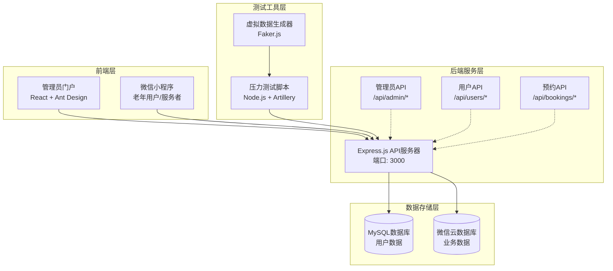
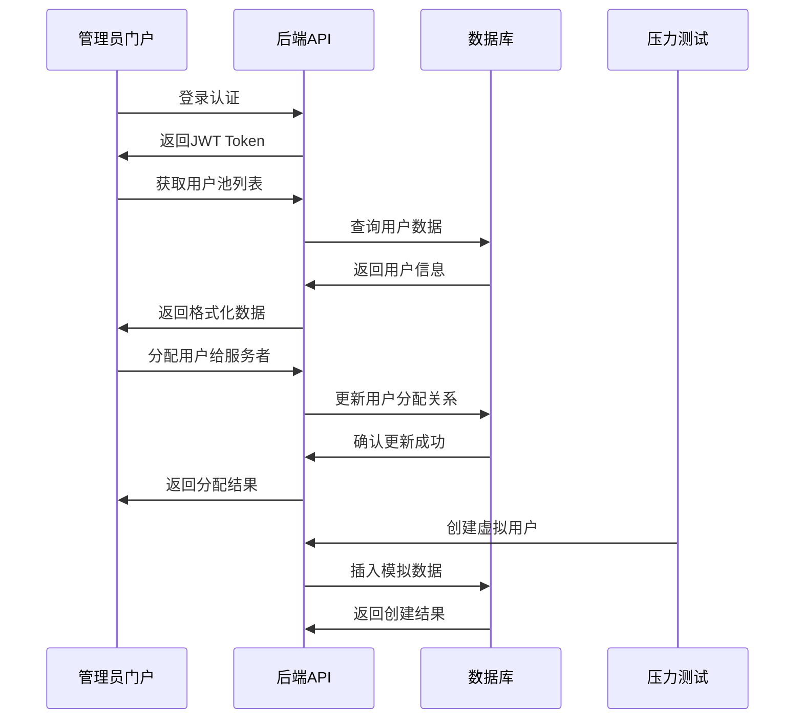
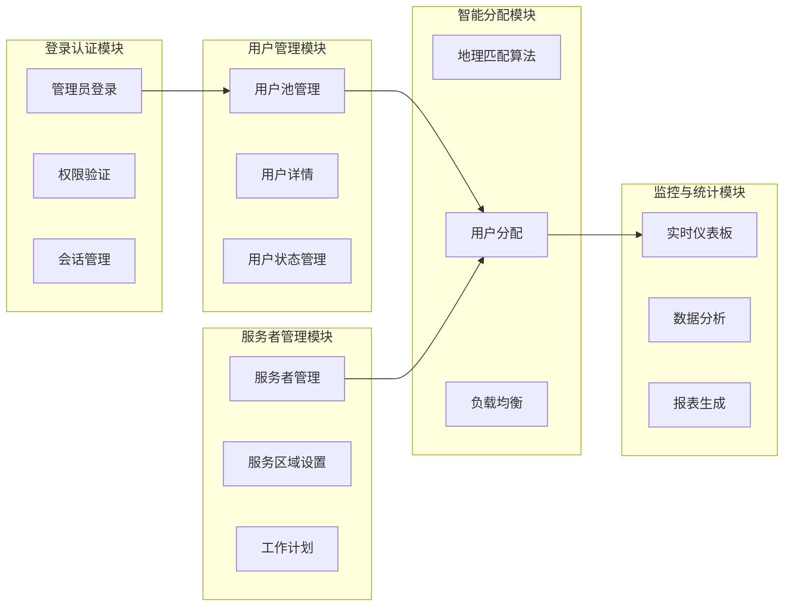
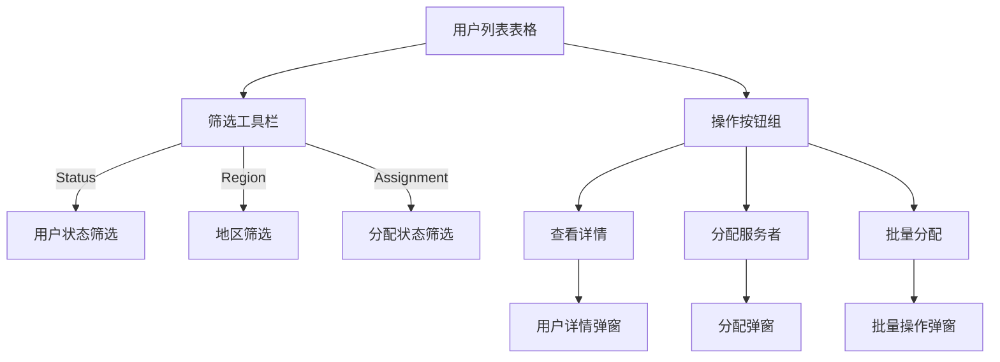
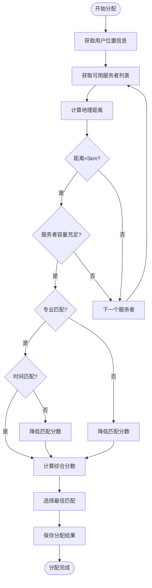
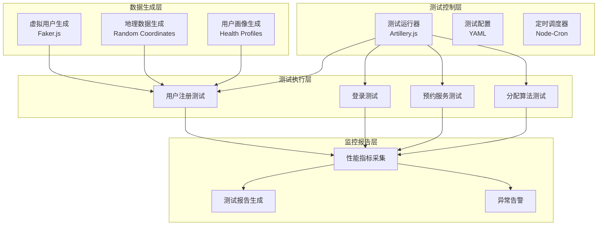

# 超级管理员门户网站和压力测试系统设计

## 概述

本设计文档描述了针对上门医疗服务小程序的超级管理员门户网站和自动化压力测试系统。系统实现三级用户角色管理：老年用户、上门服务者和超级管理员，其中超级管理员负责根据地理关系将老年用户分配给上门服务者。

### 项目背景

现有小程序已支持老年用户和上门服务者两种角色，需要增加超级管理员角色来实现：
- 用户池管理：查看和管理所有注册的老年用户
- 服务者管理：管理上门服务者信息和服务区域
- 智能分配：基于地理位置将用户分配给合适的服务者
- 系统监控：监控服务质量和用户满意度
- 压力测试：自动生成虚拟用户进行系统压力测试

### 技术目标

- 构建基于React的管理员门户网站
- 实现地理位置智能匹配算法
- 开发自动化压力测试脚本
- 集成现有Node.js后端API
- 支持实时数据监控和可视化

## 技术架构

### 整体架构图



### 系统组件交互



## 管理员门户网站设计

### 功能模块架构



### 用户界面设计

#### 主仪表板界面

| 组件 | 功能描述 | 数据源 |
|------|----------|--------|
| 头部导航 | Logo、管理员信息、退出按钮 | 本地状态 |
| 侧边栏菜单 | 功能模块导航 | 本地配置 |
| 数据卡片 | 用户总数、服务者数量、待分配用户 | API实时数据 |
| 地图组件 | 显示用户和服务者地理分布 | 用户地址数据 |
| 分配列表 | 最近的用户分配记录 | 分配历史API |

#### 用户池管理界面



#### 分配算法界面

| 匹配类型 | 算法说明 | 参数配置 |
|------------|----------|----------|
| 距离优先 | 基于地理距离最短匹配 | 最大服务距离：5公里 |
| 负载均衡 | 平衡各服务者的用户数量 | 最大用户数：20人 |
| 专业匹配 | 根据服务类型匹配专业服务者 | 服务类型权重 |
| 时间优先 | 优先分配给空闲时间匹配的服务者 | 工作时间表 |

### 后端 API 接口设计

#### 管理员认证 API

```javascript
// POST /api/admin/login
{
  "username": "admin",
  "password": "admin123"
}

// Response
{
  "success": true,
  "data": {
    "token": "jwt_token_string",
    "permissions": ["user_management", "assignment", "monitoring"],
    "expiresIn": 3600
  }
}
```

#### 用户池管理 API

```javascript
// GET /api/admin/user-pool
// Query参数: page, pageSize, status, region, assignmentStatus

// Response
{
  "success": true,
  "data": {
    "users": [
      {
        "id": "user_001",
        "nickname": "张大爷",
        "age": 75,
        "address": "北京市朝阳区三里屯街道20号",
        "latitude": 39.9204,
        "longitude": 116.4490,
        "assignedProviderId": null,
        "status": "active",
        "registerTime": "2024-01-15T10:30:00Z",
        "healthCondition": "high_blood_pressure"
      }
    ],
    "pagination": {
      "page": 1,
      "pageSize": 20,
      "total": 156,
      "totalPages": 8
    },
    "statistics": {
      "totalUsers": 156,
      "assignedUsers": 89,
      "unassignedUsers": 67
    }
  }
}
```

#### 服务者管理 API

```javascript
// GET /api/admin/service-providers

// Response
{
  "success": true,
  "data": {
    "providers": [
      {
        "id": "provider_001",
        "name": "李护士",
        "profession": "registered_nurse",
        "serviceArea": {
          "center": [39.9204, 116.4490],
          "radius": 5000
        },
        "maxUsers": 20,
        "currentUsers": 15,
        "workSchedule": [
          {"day": "monday", "startTime": "08:00", "endTime": "17:00"},
          {"day": "tuesday", "startTime": "08:00", "endTime": "17:00"}
        ],
        "specialties": ["blood_pressure", "diabetes_care"],
        "rating": 4.8,
        "status": "active"
```

#### 智能分配 API

```javascript
// POST /api/admin/assign-user
{
  "userId": "user_001",
  "providerId": "provider_001",
  "assignmentType": "manual", // manual | automatic
  "priority": "high",
  "notes": "用户有高血压，需要专业护士"
}

// POST /api/admin/auto-assign
{
  "userIds": ["user_001", "user_002"],
  "algorithm": "distance_priority", // distance_priority | load_balance | specialty_match
  "maxDistance": 5000,
  "preferences": {
    "considerSpecialty": true,
    "considerSchedule": true,
    "balanceLoad": true
  }
}

// Response
{
  "success": true,
  "data": {
    "assignments": [
      {
        "userId": "user_001",
        "providerId": "provider_001",
        "distance": 1200,
        "matchScore": 0.95,
        "reason": "距离近，专业匹配"
      }
    ],
    "failed": [],
    "statistics": {
      "totalProcessed": 1,
      "successful": 1,
      "failed": 0
    }
  }
}
```

### 地理匹配算法设计



#### 分配算法评分机制

| 因子 | 权重 | 计算方法 | 分值范围 |
|------|------|----------|----------|
| 地理距离 | 40% | `(5000 - distance) / 5000 * 40` | 0-40 |
| 专业匹配度 | 30% | 匹配专业数 / 总专业数 * 30 | 0-30 |
| 负载均衡 | 20% | `(maxUsers - currentUsers) / maxUsers * 20` | 0-20 |
| 时间匹配 | 10% | 工作时间重叠度 * 10 | 0-10 |
| **总分** | **100%** | **各因子分数之和** | **0-100** |

## 压力测试系统设计

### 测试框架架构



### 虚拟用户生成规则

#### 用户基本信息生成

```javascript
// 虚拟用户数据模板
const generateVirtualUser = () => {
  const faker = require('faker');
  faker.locale = 'zh_CN';
  
  return {
    nickname: faker.name.lastName() + (Math.random() > 0.5 ? '大爷' : '大妈'),
    realName: faker.name.findName(),
    age: faker.datatype.number({min: 60, max: 90}),
    gender: faker.random.arrayElement(['男', '女']),
    phone: '1' + faker.datatype.number({min: 3000000000, max: 8999999999}),
    address: generateBeijingAddress(),
    healthCondition: faker.random.arrayElement([
      'high_blood_pressure', 'diabetes', 'heart_disease', 'healthy'
    ]),
    emergencyContact: faker.name.findName() + ' ' + 
                     '1' + faker.datatype.number({min: 3000000000, max: 8999999999}),
    registerTime: faker.date.recent(30),
    status: 'active'
  };
};
```

#### 地理位置生成算法

```javascript
// 北京市区域坐标生成
const generateBeijingAddress = () => {
  const districts = [
    { name: '朝阳区', center: [39.9204, 116.4490] },
    { name: '海淀区', center: [39.9593, 116.2979] },
    { name: '西城区', center: [39.9142, 116.3660] },
    { name: '东城区', center: [39.9180, 116.4175] },
    { name: '丰台区', center: [39.8585, 116.2867] }
  ];
  
  const district = faker.random.arrayElement(districts);
  const offsetLat = (Math.random() - 0.5) * 0.02; // 约1km范围
  const offsetLng = (Math.random() - 0.5) * 0.02;
  
  return {
    district: district.name,
    address: `${district.name}${faker.address.streetName()}${faker.datatype.number({min: 1, max: 999})}号`,
    latitude: district.center[0] + offsetLat,
    longitude: district.center[1] + offsetLng
  };
};
```

### 压力测试脚本配置

#### Artillery.js 测试配置

```yaml
config:
  target: 'http://localhost:3000'
  phases:
    - duration: 60
      arrivalRate: 1  # 每秒1个虚拟用户
      name: "预热阶段"
    - duration: 300
      arrivalRate: 5  # 每秒5个虚拟用户
      name: "正常负载"
    - duration: 120
      arrivalRate: 20 # 每秒20个虚拟用户
      name: "压力测试"
  processor: './test-processor.js'
  
scenarios:
  - name: "用户注册流程测试"
    weight: 40
    flow:
      - function: "generateUserData"
      - post:
          url: "/api/auth/register"
          json:
            nickname: "{{ nickname }}"
            age: "{{ age }}"
            gender: "{{ gender }}"
            phone: "{{ phone }}"
            address: "{{ address }}"
      - think: 2
      
  - name: "管理员分配测试"
    weight: 30
    flow:
      - post:
          url: "/api/admin/login"
          json:
            username: "admin"
            password: "admin123"
          capture:
            - json: "$.data.token"
              as: "adminToken"
      - post:
          url: "/api/admin/auto-assign"
          headers:
            Authorization: "Bearer {{ adminToken }}"
          json:
            algorithm: "distance_priority"
            maxDistance: 5000
      - think: 1

  - name: "用户使用流程测试"
    weight: 30
    flow:
      - function: "generateUserCredentials"
      - post:
          url: "/api/auth/login"
          json:
            phone: "{{ phone }}"
            code: "123456"
          capture:
            - json: "$.data.token"
              as: "userToken"
      - get:
          url: "/api/bookings"
          headers:
            Authorization: "Bearer {{ userToken }}"
      - post:
          url: "/api/bookings"
          headers:
            Authorization: "Bearer {{ userToken }}"
          json:
            serviceId: 1
            appointmentTime: "{{ futureDateTime }}"
            notes: "虚拟测试预约"
      - think: 3
```

### 测试数据处理脚本

```javascript
// test-processor.js
const faker = require('faker');
faker.locale = 'zh_CN';

module.exports = {
  generateUserData: function(context, events, done) {
    const districts = [
      { name: '朝阳区', center: [39.9204, 116.4490] },
      { name: '海淀区', center: [39.9593, 116.2979] },
      { name: '西城区', center: [39.9142, 116.3660] }
    ];
    
    const district = faker.random.arrayElement(districts);
    const offsetLat = (Math.random() - 0.5) * 0.02;
    const offsetLng = (Math.random() - 0.5) * 0.02;
    
    context.vars.nickname = faker.name.lastName() + (Math.random() > 0.5 ? '大爷' : '大妈');
    context.vars.age = faker.datatype.number({min: 60, max: 90});
    context.vars.gender = faker.random.arrayElement(['男', '女']);
    context.vars.phone = '1' + faker.datatype.number({min: 3000000000, max: 8999999999});
    context.vars.address = `${district.name}${faker.address.streetName()}${faker.datatype.number({min: 1, max: 999})}号`;
    context.vars.latitude = district.center[0] + offsetLat;
    context.vars.longitude = district.center[1] + offsetLng;
    
    return done();
  },
  
  generateUserCredentials: function(context, events, done) {
    context.vars.phone = '1' + faker.datatype.number({min: 3000000000, max: 8999999999});
    context.vars.futureDateTime = faker.date.future(0.1).toISOString();
    return done();
  }
};
```

## 数据库设计扩展

### 新增数据表结构

```sql
-- 服务者信息表
CREATE TABLE service_providers (
    id VARCHAR(50) PRIMARY KEY,
    name VARCHAR(100) NOT NULL,
    profession ENUM('doctor', 'nurse', 'therapist') NOT NULL,
    license_number VARCHAR(50) UNIQUE NOT NULL,
    phone VARCHAR(20) NOT NULL,
    email VARCHAR(100),
    
    -- 服务区域信息
    service_center_lat DECIMAL(10, 8),
    service_center_lng DECIMAL(11, 8),
    service_radius INT DEFAULT 5000,
    
    -- 容量配置
    max_users INT DEFAULT 20,
    current_users INT DEFAULT 0,
    
    -- 专业信息
    specialties JSON,
    work_schedule JSON,
    
    -- 评价信息
    rating DECIMAL(3,2) DEFAULT 5.0,
    total_services INT DEFAULT 0,
    
    status ENUM('active', 'inactive', 'busy') DEFAULT 'active',
    created_at TIMESTAMP DEFAULT CURRENT_TIMESTAMP,
    updated_at TIMESTAMP DEFAULT CURRENT_TIMESTAMP ON UPDATE CURRENT_TIMESTAMP
);

-- 用户分配关系表
CREATE TABLE user_assignments (
    id VARCHAR(50) PRIMARY KEY,
    user_id VARCHAR(50) NOT NULL,
    provider_id VARCHAR(50) NOT NULL,
    
    -- 分配信息
    assignment_type ENUM('manual', 'automatic') NOT NULL,
    match_score DECIMAL(5,2),
    distance_meters INT,
    
    -- 分配原因
    assignment_reason TEXT,
    assigned_by VARCHAR(50),
    
    -- 时间信息
    assigned_at TIMESTAMP DEFAULT CURRENT_TIMESTAMP,
    valid_until TIMESTAMP,
    
    status ENUM('active', 'expired', 'cancelled') DEFAULT 'active',
    
    FOREIGN KEY (user_id) REFERENCES users(id),
    FOREIGN KEY (provider_id) REFERENCES service_providers(id),
    
    INDEX idx_user_provider (user_id, provider_id),
    INDEX idx_assignment_time (assigned_at),
    INDEX idx_status_valid (status, valid_until)
);

-- 分配历史记录表
CREATE TABLE assignment_history (
    id VARCHAR(50) PRIMARY KEY,
    user_id VARCHAR(50) NOT NULL,
    old_provider_id VARCHAR(50),
    new_provider_id VARCHAR(50),
    
    change_type ENUM('initial_assign', 'reassign', 'unassign') NOT NULL,
    change_reason TEXT,
    changed_by VARCHAR(50),
    
    created_at TIMESTAMP DEFAULT CURRENT_TIMESTAMP,
    
    FOREIGN KEY (user_id) REFERENCES users(id),
    FOREIGN KEY (old_provider_id) REFERENCES service_providers(id),
    FOREIGN KEY (new_provider_id) REFERENCES service_providers(id),
    
    INDEX idx_user_history (user_id, created_at),
    INDEX idx_provider_history (new_provider_id, created_at)
);

-- 测试数据记录表
CREATE TABLE load_test_records (
    id VARCHAR(50) PRIMARY KEY,
    test_session VARCHAR(100) NOT NULL,
    virtual_user_id VARCHAR(50) NOT NULL,
    
    -- 测试类型
    test_type ENUM('registration', 'login', 'booking', 'assignment') NOT NULL,
    test_scenario VARCHAR(100),
    
    -- 性能数据
    response_time_ms INT,
    success BOOLEAN DEFAULT FALSE,
    error_message TEXT,
    
    -- 虚拟用户信息
    generated_data JSON,
    
    created_at TIMESTAMP DEFAULT CURRENT_TIMESTAMP,
    
    INDEX idx_test_session (test_session, created_at),
    INDEX idx_test_type (test_type, created_at),
    INDEX idx_performance (response_time_ms, success)
);
```

### 数据查询优化

```sql
-- 地理位置快速查询索引
ALTER TABLE users ADD SPATIAL INDEX idx_user_location (POINT(longitude, latitude));
ALTER TABLE service_providers ADD SPATIAL INDEX idx_provider_location (POINT(service_center_lng, service_center_lat));

-- 分配查询优化视图
CREATE VIEW user_assignment_view AS
SELECT 
    u.id as user_id,
    u.nickname,
    u.latitude as user_lat,
    u.longitude as user_lng,
    sp.id as provider_id,
    sp.name as provider_name,
    sp.service_center_lat as provider_lat,
    sp.service_center_lng as provider_lng,
    ua.distance_meters,
    ua.match_score,
    ua.assigned_at,
    ua.status as assignment_status
FROM users u
LEFT JOIN user_assignments ua ON u.id = ua.user_id AND ua.status = 'active'
LEFT JOIN service_providers sp ON ua.provider_id = sp.id
WHERE u.status = 'active';
```

## 实现步骤

### 阶段一：后端API扩展（2-3天）

1. **数据库设计**
   - 创建服务者表和分配关系表
   - 添加地理位置索引优化
   - 数据迁移脚本编写

2. **API接口开发**
   - 扩展`/api/admin/*`路由
   - 实现服务者管理API
   - 实现分配算法API

### 阶段二：前端门户开发（4-5天）

1. **项目初始化**
   ```bash
   npx create-react-app admin-portal
   cd admin-portal
   npm install antd axios react-router-dom
   npm install @ant-design/charts leaflet react-leaflet
   ```

2. **核心组件开发**
   - 用户池管理组件
   - 地图展示组件
   - 分配算法配置组件
   - 数据可视化仪表板

### 阶段三：压力测试开发（2-3天）

1. **测试框架搭建**
   ```bash
   npm install -g artillery
   npm install faker node-cron
   mkdir load-tests && cd load-tests
   ```

2. **测试脚本开发**
   - 虚拟用户数据生成器
   - Artillery测试配置文件
   - 自动化执行脚本
   - 测试报告生成器

### 阶段四：集成测试（1-2天）

1. **系统集成测试**
2. **性能优化和调优**
3. **用户验收测试**
4. **文档完善和交付**
```