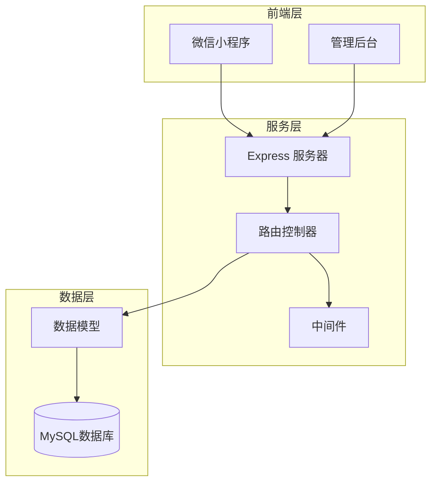
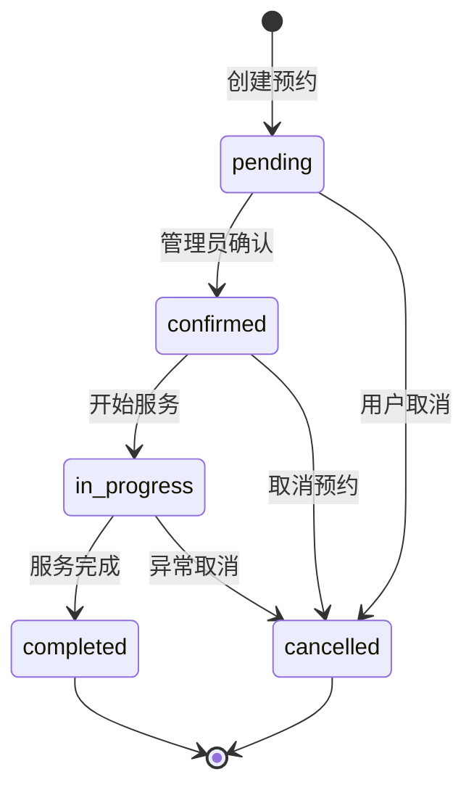
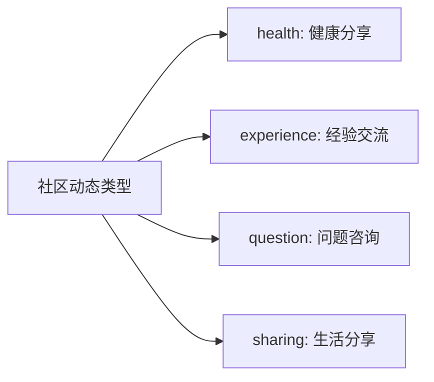
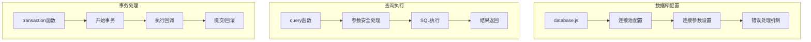
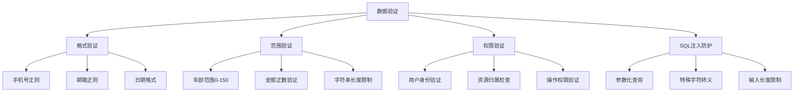
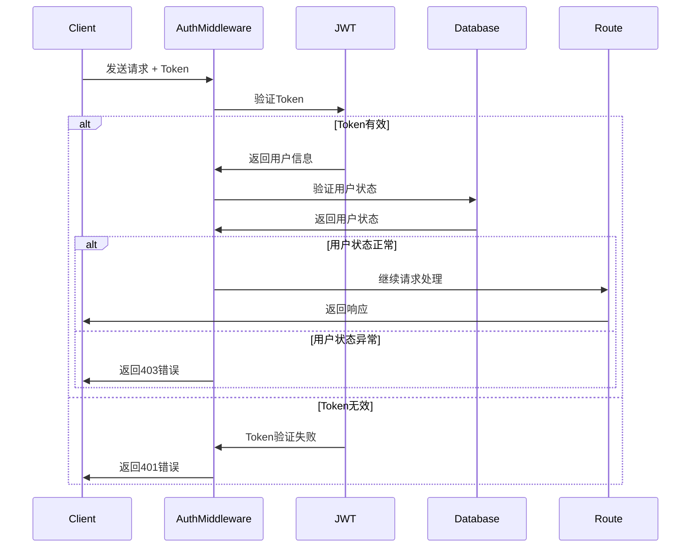
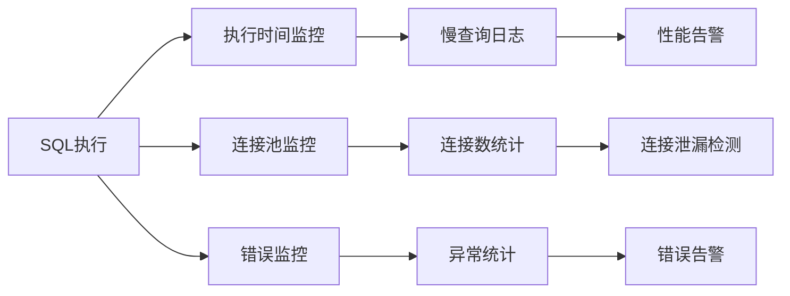
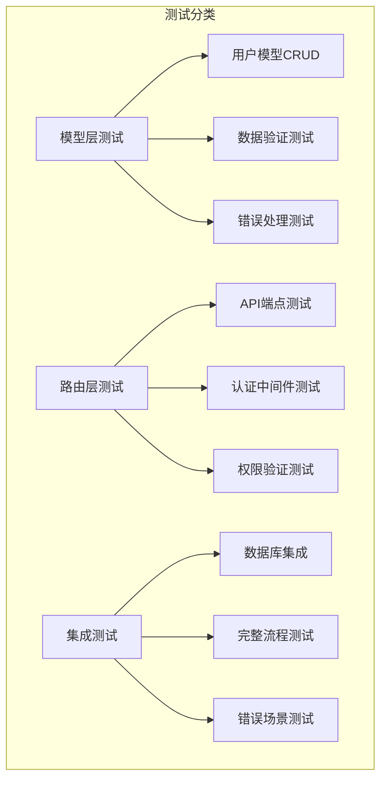
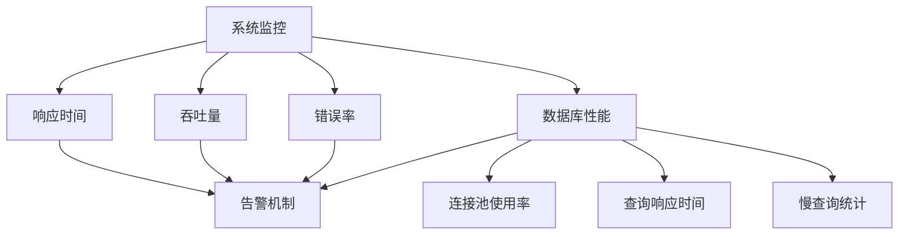

# 健康守护微信小程序后端代码检测与文档化设计

## 概述

本文档对健康守护微信小程序后端 server 文件夹下的代码进行全面检测，分析服务端函数与MySQL表的关系，并形成完整的API文档和数据库表字段说明文档。

### 系统架构概览



### 技术栈
- **框架**: Node.js + Express.js
- **数据库**: MySQL 
- **认证**: JWT + 微信授权
- **ORM**: 原生SQL查询
- **测试**: Jest

## 后端服务架构分析

### 核心文件结构

```
server/
├── app.js                    # Express应用入口
├── config/
│   └── database.js          # 数据库配置和连接池
├── middlewares/
│   └── auth.js              # 认证中间件
├── models/
│   ├── User.js              # 用户数据模型
│   └── EnhancedUser.js      # 增强用户模型
├── routes/                  # API路由文件
│   ├── admin.js             # 管理员相关API
│   ├── auth.js              # 认证相关API
│   ├── bookings.js          # 预约订单API
│   ├── community.js         # 社区功能API
│   ├── config.js            # 配置信息API
│   ├── health.js            # 健康数据API
│   ├── hospitals.js         # 医院信息API
│   ├── services.js          # 服务类型API
│   ├── upload.js            # 文件上传API
│   └── users.js             # 用户管理API
├── scripts/                 # 数据库迁移脚本
└── utils/                   # 工具函数
```

### API路由架构

```mermaid
graph LR
    subgraph "API路由"
        A[/v1/auth] --> A1[登录认证]
        B[/v1/users] --> B1[用户管理]
        C[/v1/bookings] --> C1[预约管理]
        D[/v1/health] --> D1[健康数据]
        E[/v1/community] --> E1[社区功能]
        F[/v1/admin] --> F1[管理后台]
        G[/v1/services] --> G1[服务类型]
        H[/v1/hospitals] --> H1[医院信息]
        I[/v1/upload] --> I1[文件上传]
        J[/v1/config] --> J1[配置信息]
    end
```

## 数据库表结构与字段说明

### 1. 用户相关表

#### users - 用户基础信息表

| 字段名 | 数据类型 | 约束 | 说明 |
|--------|----------|------|------|
| id | INT | PRIMARY KEY AUTO_INCREMENT | 用户唯一标识符 |
| open_id | VARCHAR(100) | NOT NULL, UNIQUE | 微信OpenID，用于身份认证 |
| union_id | VARCHAR(100) | DEFAULT NULL | 微信UnionID，跨应用标识 |
| nickname | VARCHAR(100) | NOT NULL | 用户昵称 |
| real_name | VARCHAR(50) | DEFAULT NULL | 真实姓名 |
| avatar | VARCHAR(500) | DEFAULT NULL | 头像URL地址 |
| phone | VARCHAR(20) | DEFAULT NULL | 手机号码 |
| email | VARCHAR(100) | DEFAULT NULL | 邮箱地址 |
| id_card | VARCHAR(20) | DEFAULT NULL | 身份证号码 |
| age | INT | DEFAULT NULL | 年龄 |
| gender | ENUM('男','女','未知') | DEFAULT '未知' | 性别 |
| birthday | DATE | DEFAULT NULL | 出生日期 |
| member_level | ENUM('regular','vip') | DEFAULT 'regular' | 会员等级 |
| status | ENUM('active','inactive','frozen') | DEFAULT 'active' | 用户状态 |
| service_count | INT | DEFAULT 0 | 使用服务次数统计 |
| total_spent | DECIMAL(10,2) | DEFAULT 0.00 | 累计消费金额 |
| emergency_contact | VARCHAR(100) | DEFAULT NULL | 紧急联系人信息 |
| emergency_relation | VARCHAR(20) | DEFAULT NULL | 与紧急联系人关系 |
| health_condition | VARCHAR(200) | DEFAULT NULL | 健康状况描述 |
| allergies | TEXT | DEFAULT NULL | 过敏史记录 |
| medical_history | TEXT | DEFAULT NULL | 既往病史 |
| preferred_services | JSON | DEFAULT NULL | 偏好服务类型 |
| device_info | JSON | DEFAULT NULL | 设备信息记录 |
| last_login_ip | VARCHAR(50) | DEFAULT NULL | 最后登录IP地址 |
| last_login_time | TIMESTAMP | NULL | 最后登录时间 |
| created_at | TIMESTAMP | DEFAULT CURRENT_TIMESTAMP | 账户创建时间 |
| updated_at | TIMESTAMP | DEFAULT CURRENT_TIMESTAMP ON UPDATE | 信息更新时间 |

#### user_addresses - 用户地址表

| 字段名 | 数据类型 | 约束 | 说明 |
|--------|----------|------|------|
| id | VARCHAR(50) | PRIMARY KEY | 地址唯一标识符 |
| user_id | VARCHAR(50) | NOT NULL | 关联用户ID |
| contact_name | VARCHAR(50) | NOT NULL | 联系人姓名 |
| contact_phone | VARCHAR(20) | NOT NULL | 联系人电话 |
| address | VARCHAR(500) | NOT NULL | 详细地址描述 |
| latitude | DECIMAL(10,6) | DEFAULT NULL | 地址纬度坐标 |
| longitude | DECIMAL(10,6) | DEFAULT NULL | 地址经度坐标 |
| is_default | TINYINT(1) | DEFAULT 0 | 是否为默认地址 |
| visit_count | INT | DEFAULT 0 | 该地址服务次数 |
| last_visit | TIMESTAMP | NULL | 最后服务时间 |
| create_time | TIMESTAMP | DEFAULT CURRENT_TIMESTAMP | 地址创建时间 |
| update_time | TIMESTAMP | DEFAULT CURRENT_TIMESTAMP ON UPDATE | 地址更新时间 |

#### admin_sessions - 管理员会话表

| 字段名 | 数据类型 | 约束 | 说明 |
|--------|----------|------|------|
| id | INT | PRIMARY KEY AUTO_INCREMENT | 会话ID |
| token | VARCHAR(255) | UNIQUE NOT NULL | 会话令牌 |
| expires_at | DATETIME | NOT NULL | 令牌过期时间 |
| created_at | DATETIME | DEFAULT CURRENT_TIMESTAMP | 会话创建时间 |

### 2. 服务预约相关表

#### service_types - 服务类型表

| 字段名 | 数据类型 | 约束 | 说明 |
|--------|----------|------|------|
| id | INT | PRIMARY KEY AUTO_INCREMENT | 服务类型ID |
| name | VARCHAR(100) | NOT NULL | 服务名称 |
| description | TEXT | DEFAULT NULL | 服务详细描述 |
| price | DECIMAL(10,2) | NOT NULL | 服务价格 |
| duration | INT | DEFAULT 60 | 服务时长（分钟） |
| category | VARCHAR(50) | DEFAULT NULL | 服务分类 |
| icon | VARCHAR(10) | DEFAULT NULL | 服务图标 |
| is_active | TINYINT(1) | DEFAULT 1 | 是否启用状态 |
| sort_order | INT | DEFAULT 0 | 排序权重 |
| create_time | TIMESTAMP | DEFAULT CURRENT_TIMESTAMP | 创建时间 |
| update_time | TIMESTAMP | DEFAULT CURRENT_TIMESTAMP ON UPDATE | 更新时间 |

#### bookings - 预约订单表

| 字段名 | 数据类型 | 约束 | 说明 |
|--------|----------|------|------|
| id | INT | PRIMARY KEY AUTO_INCREMENT | 预约订单ID |
| user_id | INT | NOT NULL | 预约用户ID |
| service_type | VARCHAR(50) | NOT NULL | 服务类型标识 |
| service_date | DATE | NOT NULL | 预约服务日期 |
| service_time | TIME | NOT NULL | 预约服务时间 |
| address_id | INT | DEFAULT NULL | 服务地址ID |
| status | ENUM('pending','confirmed','in_progress','completed','cancelled') | DEFAULT 'pending' | 订单状态 |
| total_amount | DECIMAL(10,2) | DEFAULT 0.00 | 服务总费用 |
| notes | TEXT | DEFAULT NULL | 预约备注信息 |
| created_at | TIMESTAMP | DEFAULT CURRENT_TIMESTAMP | 订单创建时间 |
| updated_at | TIMESTAMP | DEFAULT CURRENT_TIMESTAMP ON UPDATE | 订单更新时间 |

#### service_records - 服务记录表

| 字段名 | 数据类型 | 约束 | 说明 |
|--------|----------|------|------|
| id | VARCHAR(50) | PRIMARY KEY | 服务记录ID |
| booking_id | VARCHAR(50) | NOT NULL | 关联预约ID |
| user_id | VARCHAR(50) | NOT NULL | 用户ID |
| nurse_id | VARCHAR(50) | NOT NULL | 服务护士ID |
| service_id | INT | NOT NULL | 服务类型ID |
| service_time | TIMESTAMP | NOT NULL | 实际服务时间 |
| duration | INT | NOT NULL | 实际服务时长（分钟） |
| status | ENUM('completed','cancelled') | DEFAULT 'completed' | 服务状态 |
| cost | DECIMAL(10,2) | NOT NULL | 实际服务费用 |
| address_id | VARCHAR(50) | NOT NULL | 服务地址ID |
| service_report | JSON | DEFAULT NULL | 服务报告数据 |
| rating | INT | DEFAULT NULL | 用户评分（1-5分） |
| feedback | TEXT | DEFAULT NULL | 用户反馈内容 |
| tags | JSON | DEFAULT NULL | 评价标签集合 |
| images | JSON | DEFAULT NULL | 服务相关图片 |
| create_time | TIMESTAMP | DEFAULT CURRENT_TIMESTAMP | 记录创建时间 |
| update_time | TIMESTAMP | DEFAULT CURRENT_TIMESTAMP ON UPDATE | 记录更新时间 |

### 3. 健康数据相关表

#### health_records - 健康记录表

| 字段名 | 数据类型 | 约束 | 说明 |
|--------|----------|------|------|
| id | VARCHAR(50) | PRIMARY KEY | 健康记录ID |
| user_id | VARCHAR(50) | NOT NULL | 用户ID |
| type | VARCHAR(50) | NOT NULL | 记录类型（血压、血糖等） |
| value | VARCHAR(100) | NOT NULL | 测量数值 |
| unit | VARCHAR(20) | DEFAULT NULL | 数值单位 |
| status | ENUM('normal','warning','danger') | DEFAULT 'normal' | 健康状态评估 |
| record_time | TIMESTAMP | NOT NULL | 记录时间 |
| source | ENUM('self','nurse','device','doctor') | DEFAULT 'self' | 数据来源 |
| notes | TEXT | DEFAULT NULL | 记录备注 |
| images | JSON | DEFAULT NULL | 相关图片信息 |
| created_at | TIMESTAMP | DEFAULT CURRENT_TIMESTAMP | 创建时间 |
| updated_at | TIMESTAMP | DEFAULT CURRENT_TIMESTAMP ON UPDATE | 更新时间 |

#### health_reports - 健康报告表

| 字段名 | 数据类型 | 约束 | 说明 |
|--------|----------|------|------|
| id | VARCHAR(50) | PRIMARY KEY | 报告ID |
| user_id | VARCHAR(50) | NOT NULL | 用户ID |
| report_type | ENUM('weekly','monthly','quarterly','yearly') | DEFAULT 'monthly' | 报告周期类型 |
| period_start | DATE | NOT NULL | 报告周期开始日期 |
| period_end | DATE | NOT NULL | 报告周期结束日期 |
| overall_score | INT | DEFAULT NULL | 综合健康评分 |
| risk_level | ENUM('low','medium','high') | DEFAULT 'low' | 风险等级 |
| summary | JSON | DEFAULT NULL | 报告摘要信息 |
| details | JSON | DEFAULT NULL | 详细分析数据 |
| suggestions | JSON | DEFAULT NULL | 健康建议 |
| generate_time | TIMESTAMP | DEFAULT CURRENT_TIMESTAMP | 报告生成时间 |

### 4. 社区功能相关表

#### community_posts - 社区动态表

| 字段名 | 数据类型 | 约束 | 说明 |
|--------|----------|------|------|
| id | VARCHAR(50) | PRIMARY KEY | 动态ID |
| user_id | VARCHAR(50) | NOT NULL | 发布用户ID |
| type | ENUM('health','experience','question','sharing') | DEFAULT 'sharing' | 动态类型 |
| title | VARCHAR(200) | DEFAULT NULL | 动态标题 |
| content | TEXT | NOT NULL | 动态内容 |
| images | JSON | DEFAULT NULL | 图片列表 |
| like_count | INT | DEFAULT 0 | 点赞数量 |
| comment_count | INT | DEFAULT 0 | 评论数量 |
| view_count | INT | DEFAULT 0 | 浏览次数 |
| status | ENUM('published','draft','deleted') | DEFAULT 'published' | 发布状态 |
| is_top | TINYINT(1) | DEFAULT 0 | 是否置顶 |
| publish_time | TIMESTAMP | DEFAULT CURRENT_TIMESTAMP | 发布时间 |
| update_time | TIMESTAMP | DEFAULT CURRENT_TIMESTAMP ON UPDATE | 更新时间 |

#### post_likes - 动态点赞表

| 字段名 | 数据类型 | 约束 | 说明 |
|--------|----------|------|------|
| id | INT | PRIMARY KEY AUTO_INCREMENT | 点赞记录ID |
| post_id | VARCHAR(50) | NOT NULL | 动态ID |
| user_id | VARCHAR(50) | NOT NULL | 点赞用户ID |
| created_at | TIMESTAMP | DEFAULT CURRENT_TIMESTAMP | 点赞时间 |

### 5. 知识问答相关表

#### health_knowledge - 健康知识表

| 字段名 | 数据类型 | 约束 | 说明 |
|--------|----------|------|------|
| id | VARCHAR(50) | PRIMARY KEY | 知识条目ID |
| title | VARCHAR(200) | NOT NULL | 知识标题 |
| summary | TEXT | DEFAULT NULL | 内容摘要 |
| content | TEXT | NOT NULL | 正文内容 |
| cover | VARCHAR(500) | DEFAULT NULL | 封面图片URL |
| author | VARCHAR(100) | DEFAULT NULL | 作者信息 |
| category | VARCHAR(50) | DEFAULT 'general' | 知识分类 |
| read_count | INT | DEFAULT 0 | 阅读次数 |
| like_count | INT | DEFAULT 0 | 点赞次数 |
| status | ENUM('draft','published','archived') | DEFAULT 'published' | 发布状态 |
| is_featured | TINYINT(1) | DEFAULT 0 | 是否推荐 |
| tags | JSON | DEFAULT NULL | 标签集合 |
| created_at | TIMESTAMP | DEFAULT CURRENT_TIMESTAMP | 创建时间 |
| updated_at | TIMESTAMP | DEFAULT CURRENT_TIMESTAMP ON UPDATE | 更新时间 |

#### qa_questions - 问答表

| 字段名 | 数据类型 | 约束 | 说明 |
|--------|----------|------|------|
| id | INT | PRIMARY KEY AUTO_INCREMENT | 问题ID |
| user_id | VARCHAR(50) | NOT NULL | 提问用户ID |
| question | TEXT | NOT NULL | 问题内容 |
| answer | TEXT | DEFAULT NULL | 回答内容 |
| doctor_name | VARCHAR(100) | DEFAULT NULL | 回答医生姓名 |
| category | VARCHAR(50) | DEFAULT 'general' | 问题分类 |
| status | ENUM('pending','answered','closed') | DEFAULT 'pending' | 问答状态 |
| is_anonymous | TINYINT(1) | DEFAULT 0 | 是否匿名提问 |
| view_count | INT | DEFAULT 0 | 浏览次数 |
| like_count | INT | DEFAULT 0 | 点赞次数 |
| created_at | TIMESTAMP | DEFAULT CURRENT_TIMESTAMP | 创建时间 |
| updated_at | TIMESTAMP | DEFAULT CURRENT_TIMESTAMP ON UPDATE | 更新时间 |
| answered_at | TIMESTAMP | NULL | 回答时间 |

## API接口与数据库表关系分析

### 用户管理模块 (/v1/users)

#### 函数与表关系映射

| API端点 | HTTP方法 | 函数名 | 主要操作表 | 关联表 | 功能描述 |
|---------|----------|--------|-----------|---------|----------|
| `/profile` | GET | `getUserProfile` | users | - | 获取用户基本信息 |
| `/profile` | PUT | `updateUserProfile` | users | - | 更新用户基本信息 |
| `/family-members` | GET | `getFamilyMembers` | family_members | users | 获取家庭成员列表 |
| `/family-members` | POST | `createFamilyMember` | family_members | users | 添加家庭成员 |
| `/family-members/:id` | PUT | `updateFamilyMember` | family_members | users | 更新家庭成员信息 |
| `/family-members/:id` | DELETE | `deleteFamilyMember` | family_members | users | 删除家庭成员 |
| `/addresses` | GET | `getUserAddresses` | user_addresses | users | 获取用户地址列表 |
| `/addresses` | POST | `createUserAddress` | user_addresses | users | 添加用户地址 |
| `/addresses/:id` | PUT | `updateUserAddress` | user_addresses | users | 更新用户地址 |
| `/addresses/:id` | DELETE | `deleteUserAddress` | user_addresses | users | 删除用户地址 |

#### 数据验证规则

```mermaid
graph TD
    A[用户信息验证] --> B[手机号格式验证]
    A --> C[邮箱格式验证]
    A --> D[年龄范围验证]
    A --> E[性别枚举验证]
    
    B --> B1[正则: /^1[3-9]\d{9}$/]
    C --> C1[正则: /^[^\s@]+@[^\s@]+\.[^\s@]+$/]
    D --> D1[范围: 0-150]
    E --> E1[枚举: male/female]
```

### 预约管理模块 (/v1/bookings)

#### 函数与表关系映射

| API端点 | HTTP方法 | 函数名 | 主要操作表 | 关联表 | 功能描述 |
|---------|----------|--------|-----------|---------|----------|
| `/` | POST | `createBooking` | bookings | users, addresses, service_types | 创建新预约 |
| `/` | GET | `getBookingList` | bookings | users, addresses, service_types | 获取预约列表 |
| `/:id` | GET | `getBookingDetail` | bookings | users, addresses, service_types | 获取预约详情 |
| `/:id` | PUT | `updateBooking` | bookings | users, addresses | 更新预约信息 |
| `/:id/cancel` | PUT | `cancelBooking` | bookings | users | 取消预约 |

#### 预约状态流转



### 健康数据模块 (/v1/health)

#### 函数与表关系映射

| API端点 | HTTP方法 | 函数名 | 主要操作表 | 关联表 | 功能描述 |
|---------|----------|--------|-----------|---------|----------|
| `/records` | POST | `createHealthRecord` | health_records | users | 创建健康记录 |
| `/records` | GET | `getHealthRecords` | health_records | users | 获取健康记录列表 |
| `/records/:id` | PUT | `updateHealthRecord` | health_records | users | 更新健康记录 |
| `/records/:id` | DELETE | `deleteHealthRecord` | health_records | users | 删除健康记录 |
| `/reports` | GET | `getHealthReports` | health_reports | users, health_records | 获取健康报告 |
| `/reports/generate` | POST | `generateHealthReport` | health_reports | users, health_records | 生成健康报告 |

#### 健康数据类型映射

| 记录类型 | 数值范围 | 单位 | 状态判断逻辑 |
|----------|----------|------|-------------|
| blood_pressure | 80-200/50-120 | mmHg | 正常：90-140/60-90，警告：超出±10，危险：超出±20 |
| blood_sugar | 3.9-11.1 | mmol/L | 正常：3.9-6.1，警告：6.1-7.0，危险：>7.0或<3.9 |
| heart_rate | 60-100 | bpm | 正常：60-100，警告：50-60或100-120，危险：<50或>120 |
| temperature | 36.0-37.5 | °C | 正常：36.0-37.3，警告：37.3-38.0，危险：<36.0或>38.0 |
| weight | 不明确 | kg | 根据BMI计算状态 |
| bmi | 18.5-24.9 | kg/m² | 正常：18.5-24.9，警告：24.9-28.0，危险：<18.5或>28.0 |

### 社区功能模块 (/v1/community)

#### 函数与表关系映射

| API端点 | HTTP方法 | 函数名 | 主要操作表 | 关联表 | 功能描述 |
|---------|----------|--------|-----------|---------|----------|
| `/posts` | GET | `getCommunityPosts` | community_posts | users, post_likes | 获取社区动态列表 |
| `/posts` | POST | `createCommunityPost` | community_posts | users | 发布社区动态 |
| `/posts/:id` | GET | `getCommunityPostDetail` | community_posts | users, post_likes | 获取动态详情 |
| `/posts/:id` | PUT | `updateCommunityPost` | community_posts | users | 更新动态内容 |
| `/posts/:id` | DELETE | `deleteCommunityPost` | community_posts | users | 删除动态 |
| `/posts/:id/like` | POST | `togglePostLike` | post_likes | users, community_posts | 切换点赞状态 |

#### 社区内容分类



### 管理员模块 (/v1/admin)

#### 函数与表关系映射

| API端点 | HTTP方法 | 函数名 | 主要操作表 | 关联表 | 功能描述 |
|---------|----------|--------|-----------|---------|----------|
| `/login` | POST | `adminLogin` | admin_sessions | - | 管理员登录 |
| `/users` | GET | `getAdminUserList` | users | bookings, service_records | 获取用户管理列表 |
| `/users/:id` | GET | `getAdminUserDetail` | users | bookings, health_records | 获取用户详细信息 |
| `/users/:id/status` | PUT | `updateUserStatus` | users | user_status_logs | 更新用户状态 |
| `/bookings` | GET | `getAdminBookingList` | bookings | users, service_types | 获取预约管理列表 |
| `/bookings/:id/confirm` | PUT | `confirmBooking` | bookings | users | 确认预约 |
| `/statistics` | GET | `getSystemStatistics` | users, bookings, health_records | service_records | 获取系统统计数据 |

## 数据访问层设计

### 数据库连接与配置



### 模型层抽象

#### UserModel 类方法映射

| 方法名 | 操作类型 | SQL表 | 返回数据 | 业务逻辑 |
|--------|----------|-------|----------|----------|
| `findByOpenId(openId)` | SELECT | users | User对象 | 通过微信OpenID查找用户，包含数据脱敏 |
| `findById(id)` | SELECT | users | User对象 | 通过用户ID查找用户信息 |
| `create(userData)` | INSERT | users | User对象 | 创建新用户，验证必填字段 |
| `update(userId, updateData)` | UPDATE | users | User对象 | 更新用户信息，验证数据格式 |
| `updateLoginInfo(userId, loginIP)` | UPDATE | users | Boolean | 更新登录信息，记录IP和时间 |
| `getList(options)` | SELECT | users | {users, pagination} | 分页获取用户列表，支持搜索筛选 |
| `getDetailById(userId)` | SELECT | users, bookings | {user, statistics} | 获取用户详情和统计信息 |
| `updateStatus(userId, status)` | UPDATE | users | Boolean | 更新用户状态，记录变更日志 |
| `incrementServiceCount(userId)` | UPDATE | users | Void | 增加用户服务次数计数 |
| `incrementTotalSpent(userId, amount)` | UPDATE | users | Void | 增加用户消费金额 |
| `getStatistics()` | SELECT | users | Statistics对象 | 获取用户统计数据 |

### 数据验证与安全

#### 输入验证规则



## 中间件架构

### 认证中间件 (authMiddleware)



### 错误处理机制

| 错误类型 | HTTP状态码 | 处理方式 | 返回格式 |
|----------|------------|----------|----------|
| 认证失败 | 401 | JsonWebTokenError | {code: 401, message: 'Token无效'} |
| 权限不足 | 403 | 业务逻辑检查 | {code: 403, message: '权限不足'} |
| 资源不存在 | 404 | 数据库查询结果为空 | {code: 404, message: '资源不存在'} |
| 参数错误 | 400 | ValidationError | {code: 400, message: '请求参数错误', details: error.details} |
| 服务器错误 | 500 | 未捕获异常 | {code: 500, message: '服务器内部错误'} |

## 性能优化与监控

### 数据库查询优化

#### 索引设计策略

| 表名 | 索引字段 | 索引类型 | 优化目标 |
|------|----------|----------|----------|
| users | open_id | UNIQUE | 微信登录查询 |
| users | phone | INDEX | 手机号搜索 |
| users | status, member_level | INDEX | 用户筛选 |
| bookings | user_id, status | INDEX | 用户预约查询 |
| bookings | service_date | INDEX | 日期范围查询 |
| health_records | user_id, record_time | INDEX | 健康数据时间序列查询 |
| community_posts | user_id, publish_time | INDEX | 用户动态时间排序 |

#### 查询性能监控



### 分页查询优化

所有列表查询API都采用统一的分页机制：
- 默认页面大小：20条记录
- 最大页面大小：100条记录
- 使用LIMIT和OFFSET进行分页
- 返回总记录数和分页信息

## 测试覆盖与质量保证

### 单元测试覆盖



### 测试数据管理

- 使用Jest测试框架
- 测试环境独立数据库
- 自动化测试数据清理
- Mock外部依赖服务

## 部署与运维

### 环境配置

| 配置项 | 开发环境 | 测试环境 | 生产环境 |
|--------|----------|----------|----------|
| 数据库连接池 | 5连接 | 10连接 | 20连接 |
| API前缀 | /api | /api | /v1 |
| 日志级别 | DEBUG | INFO | ERROR |
| JWT过期时间 | 24小时 | 24小时 | 7天 |
| CORS配置 | localhost:* | 测试域名 | 生产域名 |

### 监控指标




