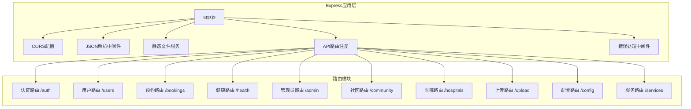
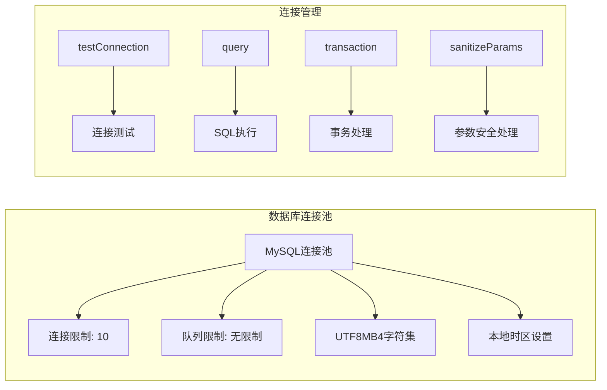
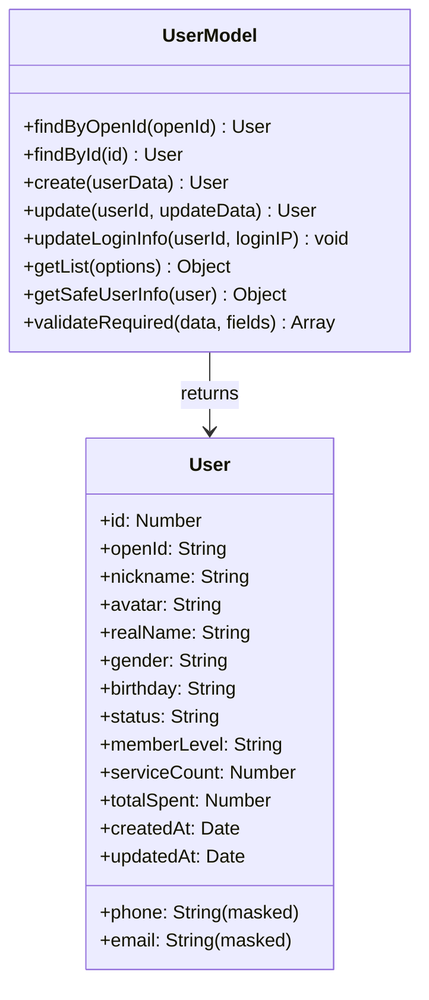
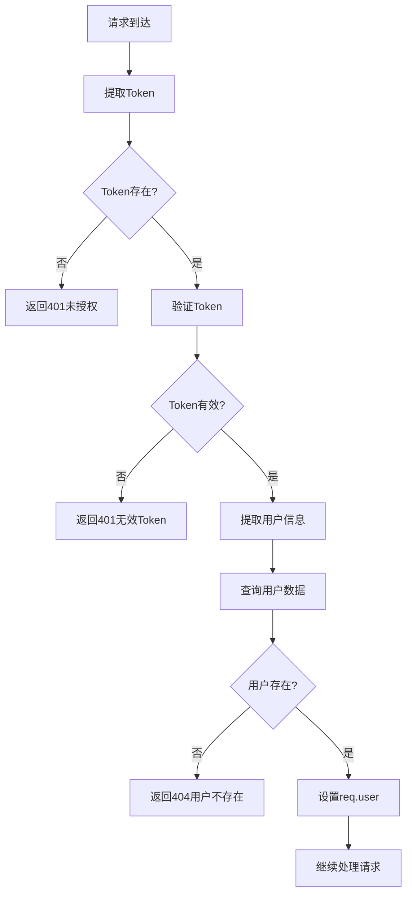

# 后端服务端代码文档和MySQL数据表完整说明

## 1. 项目概述

### 技术架构
健康守护微信小程序后端服务基于Node.js + Express + MySQL技术栈构建，采用RESTful API设计模式，提供完整的健康管理、用户管理、预约服务等功能模块。

### 核心特性
- **模块化架构**：路由、模型、中间件分离设计
- **JWT认证**：用户认证和权限管理
- **数据脱敏**：敏感信息安全处理
- **事务支持**：数据一致性保障
- **错误处理**：统一错误响应机制

## 2. 服务器应用架构

### 主应用配置 (app.js)



### 服务启动配置
- **端口配置**：默认3000，支持环境变量PORT
- **API前缀**：开发环境/v1，测试环境/api
- **CORS策略**：支持本地开发和微信服务域名
- **请求限制**：JSON请求体限制10MB
- **健康检查**：GET /health端点

## 3. 数据库架构设计

### 数据库连接配置 (config/database.js)



### 核心数据库函数
- **query(sql, params)**：安全的SQL查询执行
- **transaction(callback)**：事务处理包装器
- **testConnection()**：数据库连接状态检测
- **initDatabase()**：数据库初始化
- **sanitizeParams(params)**：参数undefined转null处理

## 4. 数据模型架构

### 用户模型 (models/User.js)



### 增强用户模型 (models/EnhancedUser.js)
包含订阅信息、支付记录、地址信息、健康数据的完整用户模型，支持复杂查询和数据关联。

## 5. API接口完整文档

### 5.1 认证模块 (routes/auth.js)

#### POST /v1/auth/register
**功能**：用户注册
**请求参数**：
```json
{
  "openId": "string (必填)",
  "nickname": "string (必填)",
  "avatar": "string (可选)",
  "phone": "string (可选)",
  "email": "string (可选)",
  "realName": "string (可选)",
  "gender": "string (可选)",
  "birthday": "string (可选)"
}
```

**响应格式**：
```json
{
  "code": 200,
  "success": true,
  "message": "注册成功",
  "data": {
    "token": "JWT_TOKEN",
    "user": {
      "id": "number",
      "openId": "string",
      "nickname": "string",
      "avatar": "string",
      "memberLevel": "regular"
    }
  }
}
```

#### POST /v1/auth/login
**功能**：用户登录
**请求参数**：
```json
{
  "openId": "string (必填)",
  "nickname": "string (新用户必填)",
  "avatar": "string (可选)"
}
```

#### POST /v1/auth/wechat-login
**功能**：微信授权登录
**请求参数**：
```json
{
  "code": "string (必填，微信授权码)",
  "userInfo": {
    "nickName": "string",
    "avatarUrl": "string",
    "gender": "number"
  }
}
```

#### GET /v1/auth/user-info
**功能**：获取当前用户信息
**认证**：Bearer Token
**响应**：当前用户完整信息

#### PUT /v1/auth/user-info
**功能**：更新用户信息
**认证**：Bearer Token
**请求参数**：
```json
{
  "realName": "string (必填)",
  "phone": "string (手机号格式验证)",
  "email": "string (邮箱格式验证)",
  "age": "number",
  "gender": "string",
  "birthday": "string",
  "emergencyContact": "string",
  "emergencyRelation": "string"
}
```

### 5.2 用户管理模块 (routes/users.js)

#### GET /v1/users/profile
**功能**：获取用户档案信息
**认证**：Bearer Token
**响应字段**：
- id, openid, nickname, realName, avatar
- phone, email, age, gender, birthday
- memberLevel, registerTime, lastVisit

#### PUT /v1/users/profile
**功能**：更新用户档案
**认证**：Bearer Token
**数据验证**：
- 手机号：正则 `/^1[3-9]\d{9}$/`
- 邮箱：正则 `/^[^\s@]+@[^\s@]+\.[^\s@]+$/`
- 年龄：0-150范围
- 性别：male/female枚举

#### GET /v1/users/family-members
**功能**：获取家庭成员列表
**认证**：Bearer Token
**响应数据**：成员信息数组，包含关系、年龄、性别、医疗史等

#### POST /v1/users/family-members
**功能**：添加家庭成员
**请求参数**：
```json
{
  "name": "string (必填)",
  "relation": "string (必填，father/mother/spouse/child/sibling/grandparent/other)",
  "age": "number (必填，0-150)",
  "gender": "string (必填，male/female)",
  "phone": "string (可选)",
  "idCard": "string (可选)",
  "medicalHistory": "string (可选)",
  "allergies": "string (可选)"
}
```

#### PUT /v1/users/family-members/:id
**功能**：更新家庭成员信息
**权限验证**：只能修改属于当前用户的成员

#### DELETE /v1/users/family-members/:id
**功能**：删除家庭成员
**权限验证**：只能删除属于当前用户的成员

#### GET /v1/users/addresses
**功能**：获取用户地址列表
**响应字段**：地址详情、默认地址标识

#### POST /v1/users/addresses
**功能**：添加新地址
**请求参数**：
```json
{
  "province": "string (必填)",
  "city": "string (必填)",
  "district": "string (必填)",
  "detail": "string (必填)",
  "contactName": "string (必填)",
  "contactPhone": "string (必填)",
  "isDefault": "boolean (可选)"
}
```

### 5.3 预约管理模块 (routes/bookings.js)

#### POST /v1/bookings
**功能**：创建服务预约
**认证**：Bearer Token
**请求参数**：
```json
{
  "serviceType": "string (必填，basic_health/comprehensive_health/home_care/emergency_care)",
  "serviceDate": "string (必填，YYYY-MM-DD格式)",
  "serviceTime": "string (必填，HH:MM格式)",
  "addressId": "number (必填)",
  "notes": "string (可选)"
}
```

**业务逻辑**：
- 服务类型价格映射：基础健康100元，全面健康200元，居家护理150元，紧急护理300元
- 日期验证：不能选择过去时间
- 地址验证：确保地址属于当前用户
- 状态初始化：pending状态

#### GET /v1/bookings
**功能**：获取用户预约列表
**查询参数**：
- page: 页码（默认1）
- limit: 每页数量（默认20，最大100）
- status: 状态筛选（all/pending/confirmed/in_progress/completed/cancelled）

**响应格式**：
```json
{
  "data": {
    "bookings": [...],
    "pagination": {
      "page": 1,
      "limit": 20,
      "total": 100,
      "totalPages": 5
    }
  }
}
```

#### GET /v1/bookings/:id
**功能**：获取预约详情
**权限验证**：只能查看属于自己的预约

#### PUT /v1/bookings/:id
**功能**：更新预约信息
**业务规则**：
- 已完成或已取消的预约不能修改
- 只能修改serviceDate、serviceTime、notes字段
- 权限验证：只能修改属于自己的预约

#### DELETE /v1/bookings/:id
**功能**：取消预约
**业务规则**：
- 只能取消pending或confirmed状态的预约
- 状态更新为cancelled
- 记录取消时间

### 5.4 健康管理模块 (routes/health.js)

#### GET /v1/health/records
**功能**：获取健康记录列表
**查询参数**：
- page, limit: 分页参数
- type: 记录类型筛选（all/bloodPressure/bloodSugar/heartRate/weight/temperature）

**响应字段**：
- id, type, value, unit, status, notes
- recordTime: 记录时间
- createdAt: 创建时间

#### POST /v1/health/records
**功能**：添加健康记录
**请求参数**：
```json
{
  "type": "string (必填，bloodPressure/bloodSugar/heartRate/weight/temperature)",
  "value": "string/number (必填)",
  "unit": "string (可选)",
  "status": "string (可选，normal/abnormal/warning)",
  "notes": "string (可选)",
  "recordTime": "string (可选，ISO格式)"
}
```

**技术实现**：
- UUID主键生成
- 时间格式转换：ISO -> MySQL datetime
- 默认状态：normal
- 自动时间戳：未提供recordTime时使用当前时间

#### GET /v1/health/metrics
**功能**：获取健康指标统计
**查询参数**：
- days: 统计天数（默认7天，最大365天）

**响应格式**：
```json
{
  "data": {
    "metrics": [
      {
        "type": "bloodPressure",
        "latestValue": "120/80",
        "unit": "mmHg",
        "status": "normal",
        "records": [
          {
            "value": "120/80",
            "date": "2024-01-01",
            "status": "normal"
          }
        ]
      }
    ]
  }
}
```

#### GET /v1/health/suggestions
**功能**：获取健康建议
**算法逻辑**：
- 基于用户近30天健康记录
- 异常数据触发特定建议
- 个性化建议生成
- 优先级分类：normal/high/urgent

### 5.5 管理员模块 (routes/admin.js)

#### POST /v1/admin/login
**功能**：管理员登录
**请求参数**：
```json
{
  "password": "string (必填)"
}
```

**有效密码**：admin123, health2024, manager888

**响应格式**：
```json
{
  "code": 200,
  "success": true,
  "data": {
    "token": "admin_token_...",
    "expiresIn": 1800,
    "permissions": ["viewUserData", "viewSensitiveInfo", "exportData", "freezeUser"],
    "expireTime": "2024-01-01T12:00:00.000Z"
  }
}
```

#### POST /v1/admin/simple-login
**功能**：简化管理员登录（调试用）
**用途**：开发测试环境快速登录

#### GET /v1/admin/users
**功能**：获取用户列表（管理员）
**认证**：Admin Bearer Token
**查询参数**：
- keyword: 关键词搜索
- status: 状态筛选
- memberLevel: 会员等级筛选
- sortBy: 排序字段
- sortOrder: 排序方向
- page, pageSize: 分页参数

#### GET /v1/admin/enhanced-users
**功能**：获取增强用户列表
**包含数据**：
- 用户基础信息
- 订阅信息
- 支付记录
- 地址信息
- 健康数据统计

#### GET /v1/admin/users/:id
**功能**：获取用户详细信息
**返回数据**：用户完整档案，包含敏感信息（手机号、身份证等）

#### PUT /v1/admin/users/:id/status
**功能**：更新用户状态
**请求参数**：
```json
{
  "status": "string (active/inactive/frozen)"
}
```

#### GET /v1/admin/stats
**功能**：获取系统统计数据
**返回数据**：
- 用户总数
- 今日新增用户
- 活跃用户数
- 预约总数
- 收入统计
- 健康记录数量

## 6. MySQL数据表结构详细说明

### 6.1 用户表 (users)

```sql
CREATE TABLE users (
  id INT PRIMARY KEY AUTO_INCREMENT,
  open_id VARCHAR(100) UNIQUE NOT NULL COMMENT '微信OpenID',
  union_id VARCHAR(100) COMMENT '微信UnionID',
  nickname VARCHAR(50) NOT NULL COMMENT '用户昵称',
  real_name VARCHAR(50) COMMENT '真实姓名',
  avatar VARCHAR(255) COMMENT '头像URL',
  phone VARCHAR(20) COMMENT '手机号',
  email VARCHAR(100) COMMENT '邮箱',
  age INT COMMENT '年龄',
  gender ENUM('male', 'female', '未知') DEFAULT '未知' COMMENT '性别',
  birthday DATE COMMENT '生日',
  member_level ENUM('regular', 'vip') DEFAULT 'regular' COMMENT '会员等级',
  service_count INT DEFAULT 0 COMMENT '服务次数',
  total_spent DECIMAL(10,2) DEFAULT 0.00 COMMENT '累计消费',
  status ENUM('active', 'inactive', 'frozen') DEFAULT 'active' COMMENT '用户状态',
  emergency_contact VARCHAR(100) COMMENT '紧急联系人',
  emergency_relation VARCHAR(50) COMMENT '紧急联系人关系',
  health_condition TEXT COMMENT '健康状况',
  allergies TEXT COMMENT '过敏史',
  last_login_ip VARCHAR(45) COMMENT '最后登录IP',
  last_login_time DATETIME COMMENT '最后登录时间',
  created_at DATETIME DEFAULT CURRENT_TIMESTAMP,
  updated_at DATETIME DEFAULT CURRENT_TIMESTAMP ON UPDATE CURRENT_TIMESTAMP,
  
  INDEX idx_open_id (open_id),
  INDEX idx_phone (phone),
  INDEX idx_status (status),
  INDEX idx_member_level (member_level),
  INDEX idx_created_at (created_at)
) COMMENT='用户表';
```

**字段说明**：
- **id**：用户唯一标识，自增主键
- **open_id**：微信用户唯一标识，用于身份认证
- **union_id**：微信开放平台统一标识
- **nickname**：用户显示名称
- **real_name**：实名认证姓名
- **avatar**：头像图片URL
- **phone/email**：联系方式（存储完整信息，前端显示时脱敏）
- **member_level**：会员等级，影响服务权益
- **service_count**：累计服务次数，用于统计和等级计算
- **total_spent**：累计消费金额
- **status**：用户状态，支持冻结等管理操作
- **emergency_contact/emergency_relation**：紧急联系人信息
- **health_condition/allergies**：健康相关信息

### 6.2 家庭成员表 (family_members)

```sql
CREATE TABLE family_members (
  id INT PRIMARY KEY AUTO_INCREMENT,
  user_id INT NOT NULL COMMENT '所属用户ID',
  name VARCHAR(50) NOT NULL COMMENT '成员姓名',
  relation ENUM('father', 'mother', 'spouse', 'child', 'sibling', 'grandparent', 'other') NOT NULL COMMENT '关系',
  age INT NOT NULL COMMENT '年龄',
  gender ENUM('male', 'female') NOT NULL COMMENT '性别',
  phone VARCHAR(20) COMMENT '手机号',
  id_card VARCHAR(20) COMMENT '身份证号',
  medical_history TEXT COMMENT '病史',
  allergies TEXT COMMENT '过敏史',
  created_at DATETIME DEFAULT CURRENT_TIMESTAMP,
  updated_at DATETIME DEFAULT CURRENT_TIMESTAMP ON UPDATE CURRENT_TIMESTAMP,
  
  FOREIGN KEY (user_id) REFERENCES users(id) ON DELETE CASCADE,
  INDEX idx_user_id (user_id),
  INDEX idx_relation (relation)
) COMMENT='家庭成员表';
```

### 6.3 用户地址表 (addresses)

```sql
CREATE TABLE addresses (
  id INT PRIMARY KEY AUTO_INCREMENT,
  user_id INT NOT NULL COMMENT '用户ID',
  province VARCHAR(50) NOT NULL COMMENT '省份',
  city VARCHAR(50) NOT NULL COMMENT '城市',
  district VARCHAR(50) NOT NULL COMMENT '区县',
  detail VARCHAR(200) NOT NULL COMMENT '详细地址',
  contact_name VARCHAR(50) NOT NULL COMMENT '联系人姓名',
  contact_phone VARCHAR(20) NOT NULL COMMENT '联系人电话',
  is_default BOOLEAN DEFAULT FALSE COMMENT '是否默认地址',
  created_at DATETIME DEFAULT CURRENT_TIMESTAMP,
  updated_at DATETIME DEFAULT CURRENT_TIMESTAMP ON UPDATE CURRENT_TIMESTAMP,
  
  FOREIGN KEY (user_id) REFERENCES users(id) ON DELETE CASCADE,
  INDEX idx_user_id (user_id),
  INDEX idx_is_default (is_default)
) COMMENT='用户地址表';
```

### 6.4 服务预约表 (bookings)

```sql
CREATE TABLE bookings (
  id INT PRIMARY KEY AUTO_INCREMENT,
  user_id INT NOT NULL COMMENT '用户ID',
  service_type ENUM('basic_health', 'comprehensive_health', 'home_care', 'emergency_care') NOT NULL COMMENT '服务类型',
  service_date DATE NOT NULL COMMENT '服务日期',
  service_time TIME NOT NULL COMMENT '服务时间',
  address_id INT NOT NULL COMMENT '服务地址ID',
  nurse_id INT COMMENT '护士ID',
  status ENUM('pending', 'confirmed', 'in_progress', 'completed', 'cancelled') DEFAULT 'pending' COMMENT '预约状态',
  total_amount DECIMAL(10,2) NOT NULL COMMENT '总金额',
  notes TEXT COMMENT '备注',
  cancelled_reason VARCHAR(200) COMMENT '取消原因',
  cancelled_at DATETIME COMMENT '取消时间',
  created_at DATETIME DEFAULT CURRENT_TIMESTAMP,
  updated_at DATETIME DEFAULT CURRENT_TIMESTAMP ON UPDATE CURRENT_TIMESTAMP,
  
  FOREIGN KEY (user_id) REFERENCES users(id) ON DELETE CASCADE,
  FOREIGN KEY (address_id) REFERENCES addresses(id),
  INDEX idx_user_id (user_id),
  INDEX idx_service_date (service_date),
  INDEX idx_status (status),
  INDEX idx_nurse_id (nurse_id)
) COMMENT='服务预约表';
```

**业务逻辑说明**：
- **service_type**：不同服务类型对应不同价格
- **status**：预约状态流转：pending -> confirmed -> in_progress -> completed
- **nurse_id**：服务分配给具体护士
- **cancelled_reason/cancelled_at**：取消预约的审计信息

### 6.5 健康记录表 (health_records)

```sql
CREATE TABLE health_records (
  id VARCHAR(36) PRIMARY KEY COMMENT '记录ID(UUID)',
  user_id INT NOT NULL COMMENT '用户ID',
  type ENUM('bloodPressure', 'bloodSugar', 'heartRate', 'weight', 'temperature') NOT NULL COMMENT '记录类型',
  value VARCHAR(100) NOT NULL COMMENT '数值',
  unit VARCHAR(20) DEFAULT '' COMMENT '单位',
  status ENUM('normal', 'abnormal', 'warning') DEFAULT 'normal' COMMENT '状态',
  notes TEXT COMMENT '备注',
  record_time DATETIME NOT NULL COMMENT '记录时间',
  created_at DATETIME DEFAULT CURRENT_TIMESTAMP,
  updated_at DATETIME DEFAULT CURRENT_TIMESTAMP ON UPDATE CURRENT_TIMESTAMP,
  
  FOREIGN KEY (user_id) REFERENCES users(id) ON DELETE CASCADE,
  INDEX idx_user_id (user_id),
  INDEX idx_type (type),
  INDEX idx_record_time (record_time),
  INDEX idx_status (status)
) COMMENT='健康记录表';
```

**技术特点**：
- **UUID主键**：避免ID冲突，支持分布式
- **type字段**：支持多种健康指标类型
- **value字段**：VARCHAR类型，支持复合数值（如血压120/80）
- **record_time**：允许用户补录历史数据

### 6.6 社区帖子表 (community_posts)

```sql
CREATE TABLE community_posts (
  id INT PRIMARY KEY AUTO_INCREMENT,
  user_id INT NOT NULL COMMENT '发帖用户ID',
  title VARCHAR(200) NOT NULL COMMENT '帖子标题',
  content TEXT NOT NULL COMMENT '帖子内容',
  type ENUM('health', 'experience', 'question', 'sharing') DEFAULT 'sharing' COMMENT '帖子类型',
  status ENUM('published', 'draft', 'deleted') DEFAULT 'published' COMMENT '状态',
  view_count INT DEFAULT 0 COMMENT '浏览次数',
  like_count INT DEFAULT 0 COMMENT '点赞次数',
  comment_count INT DEFAULT 0 COMMENT '评论次数',
  is_top BOOLEAN DEFAULT FALSE COMMENT '是否置顶',
  publish_time DATETIME DEFAULT CURRENT_TIMESTAMP COMMENT '发布时间',
  created_at DATETIME DEFAULT CURRENT_TIMESTAMP,
  updated_at DATETIME DEFAULT CURRENT_TIMESTAMP ON UPDATE CURRENT_TIMESTAMP,
  
  FOREIGN KEY (user_id) REFERENCES users(id) ON DELETE CASCADE,
  INDEX idx_user_id (user_id),
  INDEX idx_type (type),
  INDEX idx_status (status),
  INDEX idx_publish_time (publish_time),
  INDEX idx_is_top (is_top)
) COMMENT='社区帖子表';
```

### 6.7 管理员会话表 (admin_sessions)

```sql
CREATE TABLE admin_sessions (
  id INT PRIMARY KEY AUTO_INCREMENT,
  token VARCHAR(255) UNIQUE NOT NULL COMMENT '会话Token',
  session_data JSON COMMENT '会话数据',
  created_at DATETIME DEFAULT CURRENT_TIMESTAMP,
  expires_at DATETIME NOT NULL COMMENT '过期时间',
  
  INDEX idx_token (token),
  INDEX idx_expires_at (expires_at)
) COMMENT='管理员会话表';
```

## 7. 中间件和工具函数

### 7.1 认证中间件 (middlewares/auth.js)



**中间件函数**：
- **authMiddleware**：普通用户认证
- **adminAuthMiddleware**：管理员认证
- **checkAdminPermission**：管理员权限验证

### 7.2 工具函数库 (utils/index.js)

**数据脱敏函数**：
- **maskPhone(phone)**：手机号脱敏（显示前3后4位）
- **maskEmail(email)**：邮箱脱敏（保留用户名首尾字符）
- **maskIdCard(idCard)**：身份证脱敏

**响应格式化函数**：
- **response(res, data, message)**：成功响应格式
- **error(res, message, code)**：错误响应格式

**数据验证函数**：
- **validateRequired(data, fields)**：必填字段验证
- **validatePhone(phone)**：手机号格式验证
- **validateEmail(email)**：邮箱格式验证

### 7.3 JWT工具 (utils/jwt.js)

**功能函数**：
- **generateUserToken(payload)**：生成用户Token
- **generateAdminToken(payload)**：生成管理员Token
- **verifyToken(token)**：验证Token有效性
- **extractToken(req)**：从请求头提取Token

## 8. 错误处理和日志系统

### 全局错误处理
```javascript
// app.js中的错误处理中间件
app.use((error, req, res, next) => {
  console.error('服务器错误:', error);
  
  if (error.name === 'ValidationError') {
    return res.status(400).json({
      code: 400,
      message: '请求参数错误',
      details: error.details
    });
  }
  
  if (error.name === 'JsonWebTokenError') {
    return res.status(401).json({
      code: 401,
      message: 'Token无效'
    });
  }
  
  res.status(500).json({
    code: 500,
    message: '服务器内部错误',
    error: process.env.NODE_ENV === 'development' ? error.message : undefined
  });
});
```

### 数据库错误处理
- **重复条目错误**：ER_DUP_ENTRY自动处理
- **外键约束错误**：级联删除配置
- **连接超时处理**：连接池自动重试
- **事务回滚**：异常时自动回滚

## 9. 安全特性

### 数据安全
- **SQL注入防护**：参数化查询
- **XSS防护**：输入验证和转义
- **CSRF防护**：Token验证
- **敏感数据脱敏**：前端展示安全处理

### 认证安全
- **JWT Token**：有效期控制
- **密码策略**：管理员密码验证
- **会话管理**：Token黑名单机制
- **权限控制**：细粒度权限验证

### 传输安全
- **HTTPS强制**：生产环境HTTPS
- **CORS配置**：域名白名单
- **请求限制**：文件大小限制
- **头部安全**：安全头设置

## 10. 性能优化

### 数据库优化
- **索引策略**：关键字段索引覆盖
- **查询优化**：分页查询优化
- **连接池管理**：连接复用
- **事务优化**：最小事务范围

### 缓存策略
- **数据缓存**：热点数据Redis缓存
- **会话缓存**：用户会话状态缓存
- **查询缓存**：重复查询结果缓存

### 代码优化
- **异步处理**：非阻塞I/O操作
- **错误捕获**：完善的异常处理
- **资源释放**：数据库连接及时释放
- **内存管理**：避免内存泄露