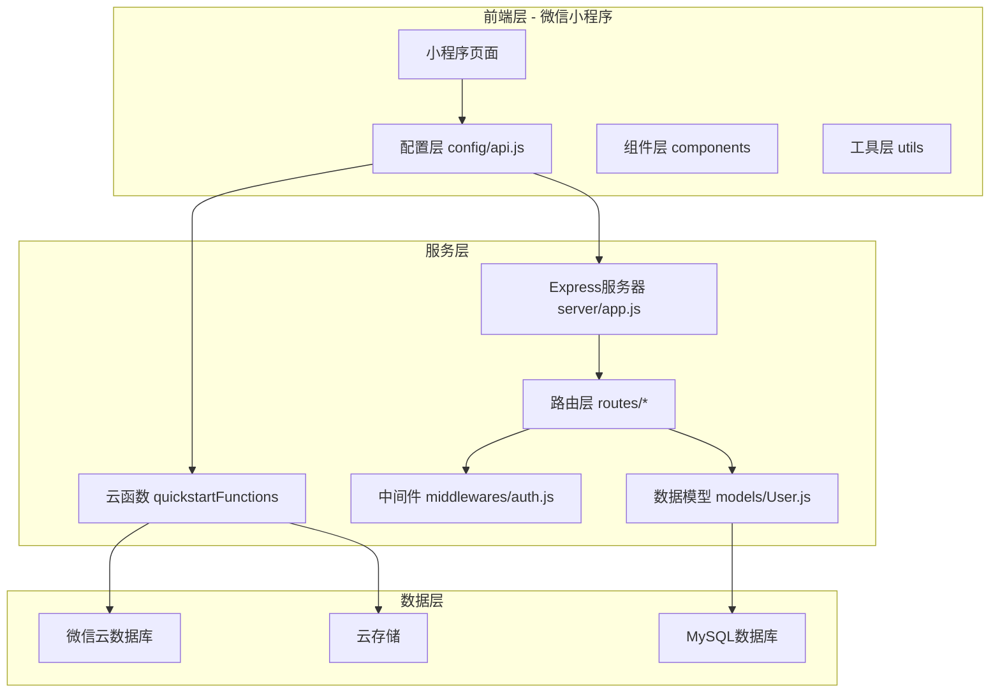
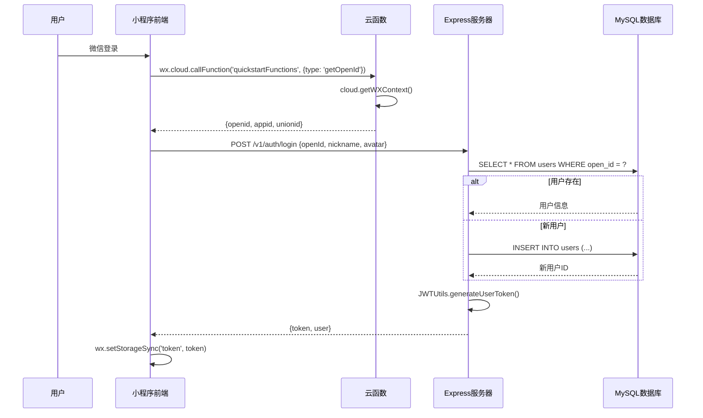
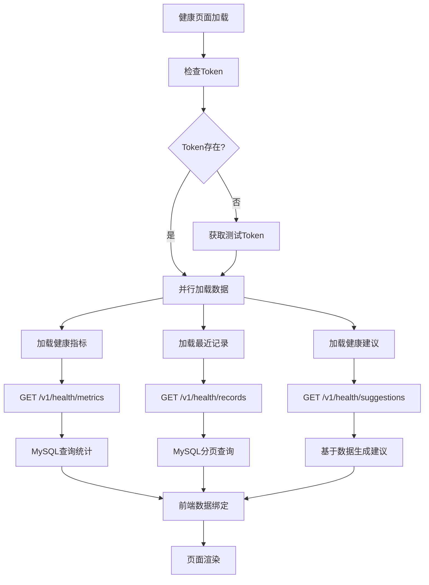
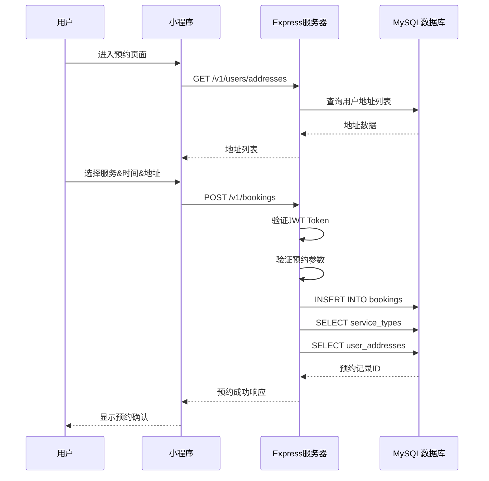

# 健康守护微信小程序 - 完整数据流向文档

## 项目概述

健康守护微信小程序采用混合架构设计，同时支持微信云开发和独立服务器后端。项目实现了双重数据存储机制：云开发数据库（JSON文档型）和MySQL数据库（关系型），为用户提供全面的健康管理服务。

## 技术架构图



## 核心数据流分析

### 1. 用户认证与会话管理

#### 1.1 微信登录流程


#### 1.2 Token验证机制
```javascript
// API请求封装 - miniprogram/config/api.js
const request = (options) => {
  const token = wx.getStorageSync('token');
  if (token) {
    requestOptions.header.Authorization = `Bearer ${token}`;
  }
  // ...发起请求
};

// 服务器端认证中间件 - server/middlewares/auth.js
const authMiddleware = (req, res, next) => {
  const token = req.header('Authorization')?.replace('Bearer ', '');
  const decoded = JWTUtils.verifyToken(token);
  req.user = decoded;
  next();
};
```

### 2. 健康数据管理流程

#### 2.1 双重存储架构
项目实现了云数据库和MySQL数据库的双重存储：

**云数据库存储**：
```javascript
// 云函数健康数据保存 - cloudfunctions/quickstartFunctions/index.js
const saveHealthData = async (event) => {
  const wxContext = cloud.getWXContext();
  const result = await db.collection('healthRecords').add({
    data: {
      openid: wxContext.OPENID,
      type: event.data.type,
      value: event.data.value,
      recordTime: event.data.recordTime || new Date()
    }
  });
  return { success: true, data: result };
};
```

**MySQL存储**：
```javascript
// 服务器端健康记录保存 - server/routes/health.js
router.post('/records', authMiddleware, async (req, res) => {
  const { type, value, unit, status, notes, recordTime } = req.body;
  const recordId = uuidv4();
  
  await query(`
    INSERT INTO health_records (id, user_id, type, value, unit, status, notes, record_time)
    VALUES (?, ?, ?, ?, ?, ?, ?, ?)
  `, [recordId, userId, type, value, unit, status, notes, recordTimeStr]);
});
```

#### 2.2 健康数据展示流程


### 3. 服务预约业务流程

#### 3.1 预约创建完整流程


#### 3.2 预约数据模型
```sql
-- 预约订单表结构
CREATE TABLE `bookings` (
  `id` varchar(50) NOT NULL COMMENT '预约ID',
  `order_no` varchar(50) NOT NULL COMMENT '订单号',
  `user_id` varchar(50) NOT NULL COMMENT '用户ID',
  `service_id` int NOT NULL COMMENT '服务类型ID',
  `appointment_time` timestamp NOT NULL COMMENT '预约时间',
  `status` enum('pending','confirmed','in_progress','completed','cancelled') DEFAULT 'pending',
  `price` decimal(10,2) NOT NULL COMMENT '服务价格',
  `address_id` varchar(50) NOT NULL COMMENT '服务地址ID',
  PRIMARY KEY (`id`)
) ENGINE=InnoDB DEFAULT CHARSET=utf8mb4;
```

### 4. API数据传输格式

#### 4.1 统一响应格式
```javascript
// 成功响应格式
{
  "success": true,
  "message": "操作成功",
  "data": {
    // 具体数据
  }
}

// 错误响应格式
{
  "success": false,
  "code": 400,
  "message": "错误信息",
  "details": "详细错误描述"
}
```

#### 4.2 健康记录数据格式
```javascript
// 请求格式
{
  "type": "bloodPressure",
  "value": "120/80",
  "unit": "mmHg",
  "status": "normal",
  "notes": "日常监测",
  "recordTime": "2024-01-27T10:30:00Z"
}

// 响应格式
{
  "success": true,
  "data": {
    "record": {
      "id": "uuid-string",
      "type": "bloodPressure",
      "value": "120/80",
      "recordTime": "2024-01-27 10:30:00"
    }
  }
}
```

### 5. 错误处理与容灾机制

#### 5.1 多层容错策略
```javascript
// 前端容错处理 - miniprogram/pages/health/index.js
async loadHealthMetrics() {
  try {
    const result = await http.get(API.HEALTH.METRICS);
    if (result.success) {
      this.setData({ healthMetrics: result.data.metrics });
    } else {
      this.setMockHealthMetrics(); // 降级到模拟数据
    }
  } catch (error) {
    console.error('API调用失败:', error);
    this.setMockHealthMetrics(); // 显示模拟数据
    wx.showToast({ title: '服务器连接失败，显示模拟数据' });
  }
}
```

#### 5.2 Token自动刷新机制
```javascript
// API配置文件自动获取测试Token
const getTestToken = async () => {
  try {
    const response = await axios.post(`${config.baseURL}/v1/auth/login`, {
      openId: 'test_open_id_12345',
      nickname: '测试用户'
    });
    const token = response.data.data.token;
    wx.setStorageSync('token', token);
    return token;
  } catch (error) {
    console.error('获取测试token失败:', error);
    throw error;
  }
};
```

### 6. 数据库设计核心表结构

#### 6.1 用户相关表
- **users**: 用户基础信息（MySQL）
- **user_addresses**: 用户地址管理（MySQL）
- **family_members**: 家庭成员信息（MySQL）

#### 6.2 业务数据表
- **service_types**: 服务类型定义（MySQL）
- **bookings**: 预约订单（MySQL）
- **health_records**: 健康记录（MySQL）
- **healthRecords**: 健康记录（云数据库）
- **sales**: 示例销售数据（云数据库）

### 7. 性能优化策略

#### 7.1 数据加载优化
```javascript
// 并行数据加载
async loadHealthData() {
  await Promise.all([
    this.loadHealthMetrics(),
    this.loadRecentRecords(),
    this.loadHealthSuggestions()
  ]);
}
```

#### 7.2 缓存策略
- **Token缓存**: 使用wx.getStorageSync本地存储
- **页面数据缓存**: 避免重复API调用
- **分页加载**: 大数据量采用分页查询

### 8. 安全控制机制

#### 8.1 认证层次
1. **微信身份认证**: 基于OpenID的用户识别
2. **JWT Token验证**: 服务器API访问控制
3. **云函数天然鉴权**: 微信生态安全机制

#### 8.2 数据验证
```javascript
// 服务器端数据验证
if (!validTypes.includes(type)) {
  return Utils.error(res, '无效的记录类型', 400);
}

if (phone && !/^1[3-9]\d{9}$/.test(phone)) {
  return Utils.error(res, '手机号格式不正确', 400);
}
```

## 总结

健康守护小程序通过混合架构实现了灵活的数据管理：
1. **双重存储**: 云数据库用于演示，MySQL用于生产
2. **统一API**: Express服务器提供RESTful接口
3. **容错机制**: 多层降级保证用户体验
4. **安全控制**: JWT认证+数据验证双重保护
5. **性能优化**: 并行加载+缓存策略提升响应速度

此架构既利用了微信云开发的便利性，又保证了生产环境的可扩展性和数据安全性。