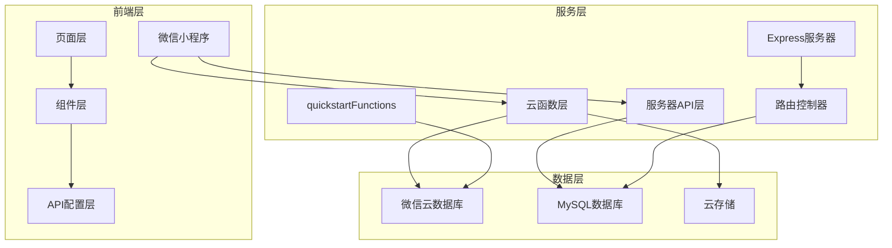
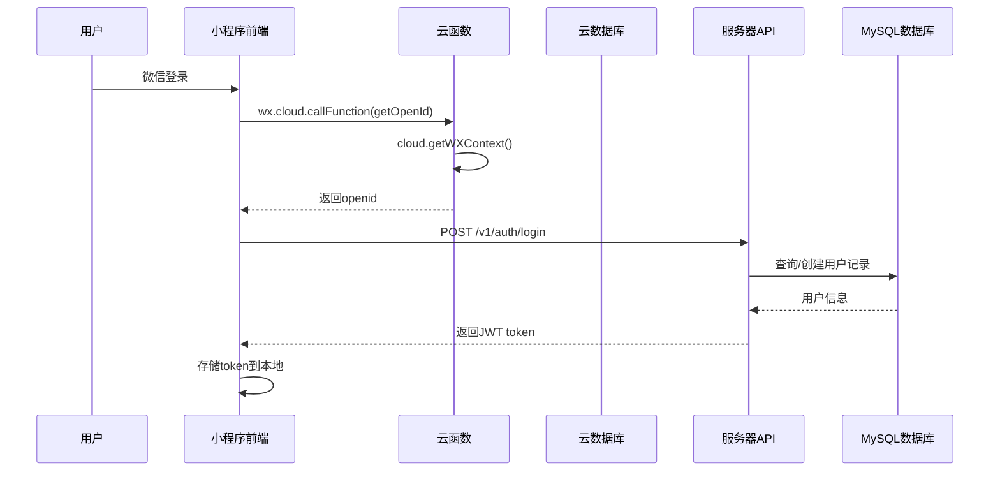
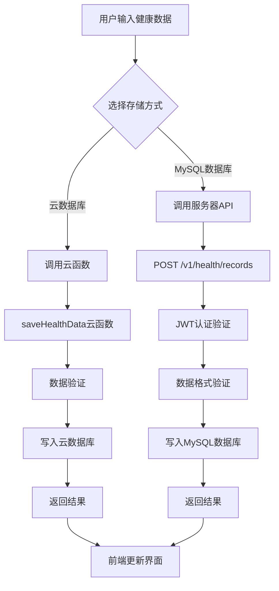
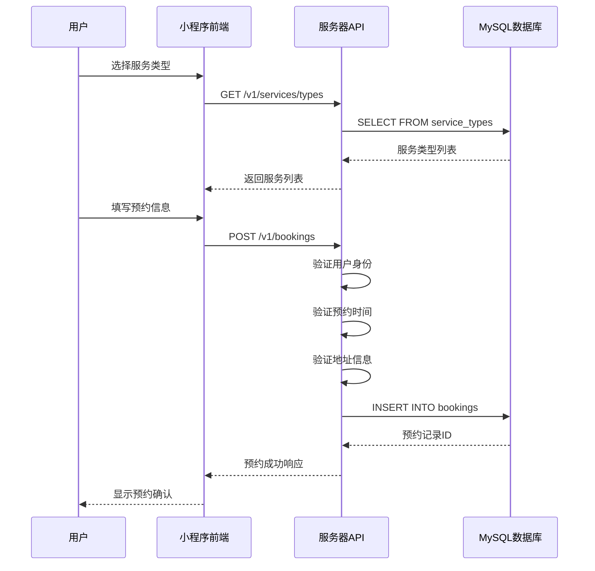
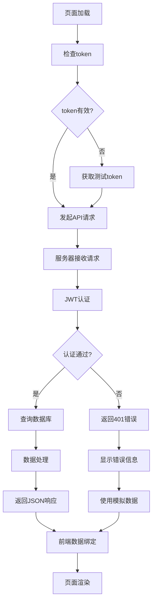
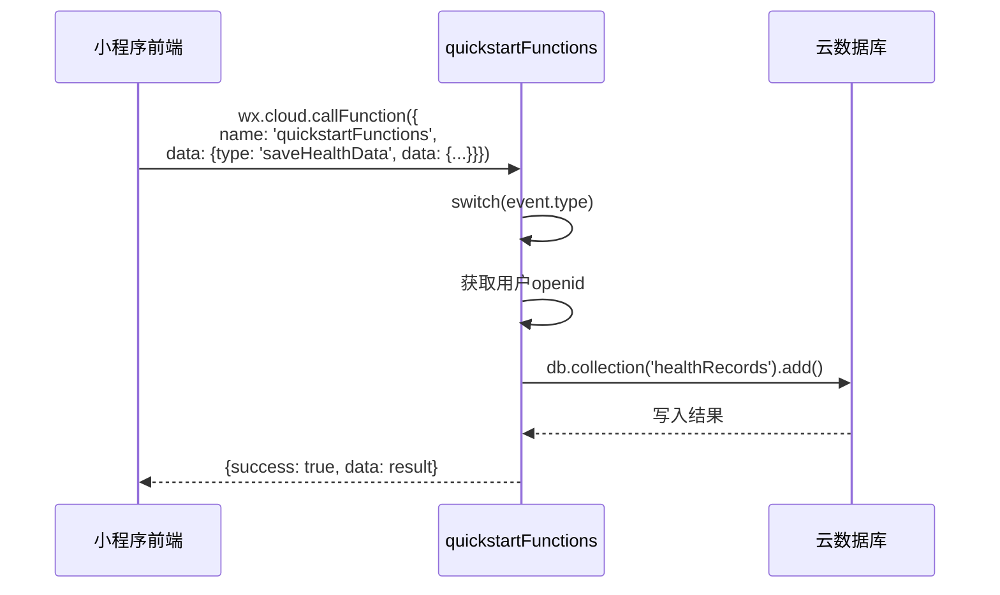
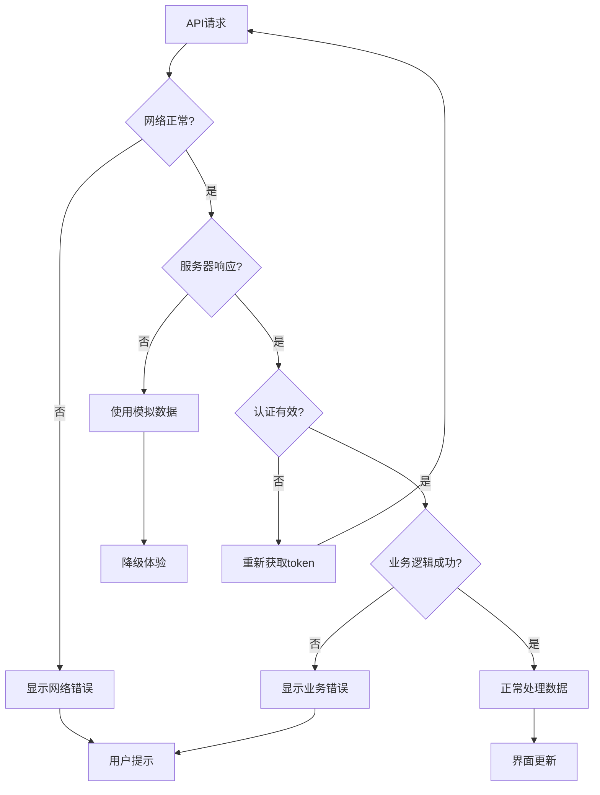

# 健康守护微信小程序 - 数据流向文档

## 项目概述

健康守护微信小程序是一个基于微信云开发和独立服务器的混合架构健康管理平台。项目采用前后端分离设计，支持双重数据存储：云开发数据库和MySQL数据库，为用户提供全面的健康管理服务。

## 技术架构

### 整体架构图



## 数据存储架构

### 数据库设计概览

项目采用双数据库架构：

1. **微信云数据库**：JSON文档型数据库，用于基础功能演示
2. **MySQL数据库**：关系型数据库，用于生产级业务数据

### 核心数据表

| 表名 | 用途 | 数据库类型 | 主要字段 |
|------|------|------------|----------|
| users | 用户基础信息 | MySQL | id, open_id, nickname, phone, age, gender |
| user_addresses | 用户地址管理 | MySQL | id, user_id, contact_name, address, latitude, longitude |
| service_types | 服务类型定义 | MySQL | id, name, price, duration, category |
| bookings | 预约订单 | MySQL | id, user_id, service_id, appointment_time, status |
| health_records | 健康记录 | MySQL | id, user_id, type, value, record_time |
| sales | 示例销售数据 | 云数据库 | region, city, sales |
| healthRecords | 健康记录(云端) | 云数据库 | openid, type, value, recordTime |

## 数据流向分析

### 1. 用户认证数据流



### 2. 健康数据录入流程



### 3. 服务预约数据流



### 4. 数据查询与展示流程



## API接口数据流

### 请求处理流程


### 核心API数据传输格式

#### 健康记录保存

**请求格式**：
```javascript
{
  type: 'bloodPressure',
  value: '120/80',
  unit: 'mmHg',
  status: 'normal',
  notes: '日常监测',
  recordTime: '2024-01-27T10:30:00Z'
}
```

**响应格式**：
```javascript
{
  success: true,
  message: '健康记录添加成功',
  data: {
    record: {
      id: 'uuid-string',
      type: 'bloodPressure',
      value: '120/80',
      recordTime: '2024-01-27 10:30:00'
    }
  }
}
```

#### 预约创建

**请求格式**：
```javascript
{
  serviceType: 'basic_health',
  serviceDate: '2024-01-28',
  serviceTime: '09:00',
  addressId: 'address-uuid',
  notes: '高血压复查'
}
```

**响应格式**：
```javascript
{
  success: true,
  message: '预约创建成功',
  data: {
    booking: {
      id: 123,
      serviceType: 'basic_health',
      status: 'pending',
      totalAmount: 100.00
    }
  }
}
```

## 云函数数据处理

### 云函数调用机制



### 云函数支持的操作类型

| 操作类型 | 功能描述 | 数据库操作 |
|----------|----------|------------|
| getOpenId | 获取用户标识 | 无 |
| saveHealthData | 保存健康数据 | INSERT |
| getHealthData | 查询健康数据 | SELECT |
| createCollection | 创建数据集合 | CREATE |
| selectRecord | 查询记录 | SELECT |
| updateRecord | 更新记录 | UPDATE |
| insertRecord | 插入记录 | INSERT |
| deleteRecord | 删除记录 | DELETE |

## 数据流控制与验证

### 数据验证层次

1. **前端验证**：用户输入基础验证
2. **API层验证**：业务逻辑验证
3. **数据库约束**：数据完整性验证

### 错误处理机制



## 性能优化策略

### 数据缓存机制

1. **本地缓存**：使用wx.getStorageSync存储token和用户信息
2. **页面缓存**：避免重复加载相同数据
3. **分页加载**：大数据量采用分页策略

### 并发处理

```javascript
// 并行加载数据示例
async loadHealthData() {
  await Promise.all([
    this.loadHealthMetrics(),
    this.loadRecentRecords(),
    this.loadHealthSuggestions()
  ]);
}
```

## 安全性设计

### 认证机制

1. **微信身份认证**：基于微信openid的用户识别
2. **JWT Token**：服务器API访问控制
3. **云函数天然鉴权**：基于微信生态的安全机制

### 数据安全

- 敏感数据加密存储
- SQL注入防护
- 跨域请求限制
- 输入数据清理

## 监控与日志

### 关键监控点

1. **API响应时间**
2. **数据库连接状态**
3. **错误率统计**
4. **用户操作轨迹**

### 日志记录

```javascript
console.log('API请求:', {
  url: requestOptions.url,
  method: requestOptions.method,
  data: requestOptions.data,
  hasToken: !!token
});
```

## 故障恢复机制

### 容错设计

1. **API调用失败**：自动降级到模拟数据
2. **网络异常**：离线缓存支持
3. **服务器故障**：云函数备用方案

### 数据一致性

- 双写机制保证数据同步
- 定期数据校验
- 异常数据回滚

## 扩展性考虑

### 水平扩展

1. **微服务架构**：业务模块独立部署
2. **数据库分片**：支持大规模用户
3. **CDN加速**：静态资源优化

### 功能扩展

- 新增业务模块的标准化接入
- API版本管理策略
- 数据迁移方案