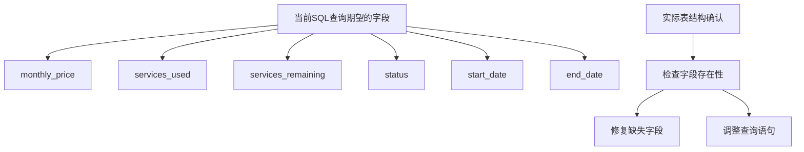
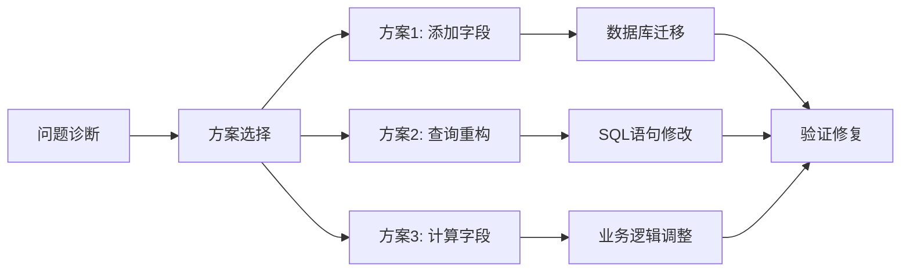

# 用户订阅查询字段错误修复设计

## 概述

本设计文档旨在修复后端用户订阅查询中的数据库字段错误问题。当前系统在获取增强用户列表时出现`Unknown column 'us.monthly_price' in 'field list'`错误，需要对数据库表结构和查询语句进行修复。

## 问题分析

### 错误详情
- **错误类型**: `ER_BAD_FIELD_ERROR`
- **错误代码**: 1054
- **错误消息**: `Unknown column 'us.monthly_price' in 'field list'`
- **出错位置**: `server/models/EnhancedUser.js:103`

### 根本原因
1. **数据库表结构不一致**: `user_subscriptions`表中缺少`monthly_price`字段
2. **查询语句与表结构不匹配**: SQL查询中引用了不存在的字段
3. **数据迁移不完整**: 可能在数据库初始化过程中某些字段创建失败

### 影响范围
- 管理后台用户列表功能无法正常使用
- 用户订阅信息显示异常
- 相关API接口调用失败

## 架构设计

### 数据库表结构修复

#### user_subscriptions表字段对比



#### 字段映射策略

| 查询字段 | 表结构字段 | 修复方案 |
|---------|-----------|----------|
| `us.monthly_price` | 缺失 | 1. 添加字段到表<br>2. 从套餐价格计算<br>3. 移除字段查询 |
| `us.services_used` | 存在 | 保持不变 |
| `us.services_remaining` | 存在 | 保持不变 |

### 修复方案架构



## 修复策略

### 策略1: 数据库字段添加（推荐）

#### 优势
- 保持业务逻辑完整性
- 最小化代码变更
- 数据存储更规范

#### 实施步骤
1. 检查`user_subscriptions`表当前结构
2. 添加缺失的`monthly_price`字段
3. 为现有数据填充默认值
4. 验证查询正常运行

#### 数据库迁移脚本
```sql
-- 添加monthly_price字段
ALTER TABLE user_subscriptions 
ADD COLUMN monthly_price DECIMAL(10,2) DEFAULT 0.00 
COMMENT '月费价格';

-- 更新现有记录的monthly_price值
UPDATE user_subscriptions us
JOIN subscription_packages sp ON us.package_id = sp.id
SET us.monthly_price = sp.price;
```

### 策略2: 查询语句重构

#### 优势
- 无需修改数据库结构
- 立即可用
- 减少存储冗余

#### 实施步骤
1. 修改SQL查询，移除`us.monthly_price`字段
2. 直接使用`sp.price`作为月费显示
3. 调整数据处理逻辑

#### 查询语句修改
```sql
-- 修改前
us.monthly_price,

-- 修改后
sp.price as monthly_price,
```

### 策略3: 混合计算方案

#### 优势
- 灵活性最高
- 支持复杂定价逻辑
- 向后兼容性好

#### 实施步骤
1. 使用CASE语句进行条件查询
2. 优先使用订阅表字段，次选套餐价格
3. 支持优惠折扣等业务逻辑

## 实施方案

### 第一阶段：紧急修复（策略2）

#### 修改EnhancedUser.js查询语句
```javascript
// 修改SQL查询字段部分
const sql = `
  SELECT 
    -- 用户基本信息
    u.id,
    u.nickname,
    u.real_name,
    -- ... 其他字段
    
    -- 订阅套餐信息（修复部分）
    sp.name as package_name,
    sp.level as package_level,
    sp.price as package_price,
    sp.price as monthly_price,  -- 使用套餐价格作为月费
    us.status as sub_status,
    us.start_date as sub_start_date,
    us.end_date as sub_end_date,
    us.services_used,
    us.services_remaining,
    
    -- ... 其他字段
`;
```

#### 数据处理逻辑调整
```javascript
// 在数据处理部分
subscription: user.package_name ? {
  packageId: user.current_subscription_id,
  packageName: user.package_name,
  level: user.package_level,
  status: user.sub_status,
  startDate: user.sub_start_date,
  endDate: user.sub_end_date,
  monthlyPrice: parseFloat(user.monthly_price || user.package_price || 0),
  servicesUsed: user.services_used || 0,
  servicesRemaining: user.services_remaining || 0
} : null,
```

### 第二阶段：结构完善（策略1）

#### 数据库检查脚本
```javascript
// 创建字段检查和修复脚本
async function checkAndFixUserSubscriptionsTable() {
  try {
    // 检查表结构
    const [columns] = await connection.execute(
      'DESCRIBE user_subscriptions'
    );
    
    const fieldNames = columns.map(col => col.Field);
    
    // 检查monthly_price字段是否存在
    if (!fieldNames.includes('monthly_price')) {
      console.log('添加monthly_price字段...');
      await connection.execute(`
        ALTER TABLE user_subscriptions 
        ADD COLUMN monthly_price DECIMAL(10,2) DEFAULT 0.00 
        COMMENT '月费价格'
      `);
      
      // 填充现有数据
      await connection.execute(`
        UPDATE user_subscriptions us
        JOIN subscription_packages sp ON us.package_id = sp.id
        SET us.monthly_price = sp.price
        WHERE us.monthly_price = 0.00
      `);
      
      console.log('monthly_price字段添加完成');
    }
  } catch (error) {
    console.error('表结构修复失败:', error);
    throw error;
  }
}
```

### 第三阶段：数据一致性保障

#### 数据同步机制
```javascript
// 在订阅创建/更新时自动同步monthly_price
async function createUserSubscription(subscriptionData) {
  const { packageId, userId, ...otherData } = subscriptionData;
  
  // 获取套餐价格
  const [packageInfo] = await query(
    'SELECT price FROM subscription_packages WHERE id = ?',
    [packageId]
  );
  
  // 创建订阅记录，自动设置monthly_price
  const subscriptionId = generateId();
  await query(`
    INSERT INTO user_subscriptions (
      id, user_id, package_id, monthly_price, 
      start_date, end_date, status, create_time
    ) VALUES (?, ?, ?, ?, ?, ?, ?, NOW())
  `, [
    subscriptionId,
    userId,
    packageId,
    packageInfo.price,  // 自动设置月费
    otherData.startDate,
    otherData.endDate,
    'active'
  ]);
  
  return subscriptionId;
}
```

## 测试验证

### 数据库连接测试
```javascript
// 测试数据库字段是否存在
async function testFieldExists() {
  try {
    const result = await query(`
      SELECT monthly_price 
      FROM user_subscriptions 
      LIMIT 1
    `);
    console.log('monthly_price字段测试通过');
    return true;
  } catch (error) {
    console.log('monthly_price字段不存在:', error.message);
    return false;
  }
}
```

### API功能测试
```javascript
// 测试增强用户列表API
async function testEnhancedUserList() {
  try {
    const result = await EnhancedUserModel.getEnhancedUsers({
      page: 1,
      pageSize: 10
    });
    
    console.log(`成功获取${result.users.length}个用户记录`);
    
    // 验证订阅信息完整性
    const userWithSubscription = result.users.find(u => u.subscription);
    if (userWithSubscription) {
      console.log('订阅信息示例:', {
        monthlyPrice: userWithSubscription.subscription.monthlyPrice,
        packageName: userWithSubscription.subscription.packageName
      });
    }
    
    return true;
  } catch (error) {
    console.error('API测试失败:', error);
    return false;
  }
}
```

## 风险评估

### 技术风险
| 风险项 | 影响程度 | 缓解措施 |
|-------|---------|---------|
| 数据库结构变更失败 | 高 | 备份数据库，分步骤执行 |
| 现有数据丢失 | 高 | 完整备份，增量更新 |
| API兼容性问题 | 中 | 向后兼容处理 |
| 性能影响 | 低 | 查询优化，索引添加 |

### 业务风险
| 风险项 | 影响程度 | 缓解措施 |
|-------|---------|---------|
| 用户体验中断 | 中 | 快速修复，灰度发布 |
| 数据一致性问题 | 中 | 数据验证，一致性检查 |
| 运营数据不准确 | 低 | 数据校验，报表更新 |

## 监控与维护

### 监控指标
- 数据库查询错误率
- API响应时间
- 订阅数据完整性
- 字段空值比例

### 维护计划
1. **日常监控**: 查询错误日志，性能指标
2. **周期检查**: 数据一致性验证
3. **版本更新**: 数据库schema版本管理
4. **应急响应**: 快速回滚机制