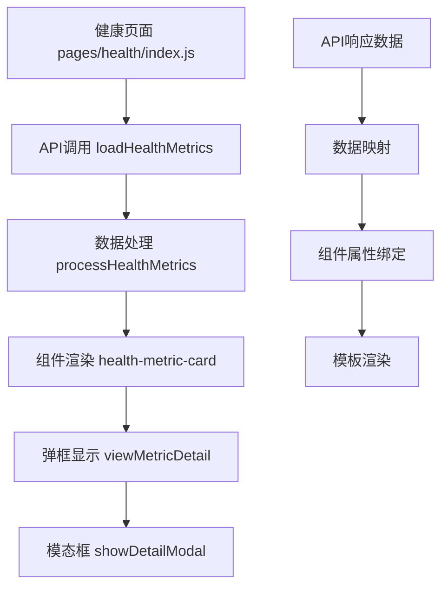

# 健康预览弹框Undefined问题分析与解决方案

## 概述
在健康档案页面中，用户点击健康指标卡片或查看详情时弹出的模态框中显示大量"undefined"字符串，影响用户体验。本文档分析问题根源并提供解决方案。

## 问题分析

### 问题现象
- 健康指标卡片显示undefined值
- 弹框中健康数据字段显示undefined
- 用户体验受到严重影响

### 代码结构分析



### 数据流向分析

#### API数据结构问题
```javascript
// 期望的API响应格式
{
  "success": true,
  "data": {
    "metrics": [
      {
        "type": "bloodPressure",
        "latestValue": "120/80",
        "unit": "mmHg", 
        "status": "normal"
      }
    ]
  }
}

// 实际可能的响应格式（缺少字段）
{
  "success": true,
  "data": {
    "metrics": [
      {
        "type": "bloodPressure"
        // 缺少 latestValue, unit, status 等字段
      }
    ]
  }
}
```

#### 组件属性映射问题
在`processHealthMetrics`方法中存在数据映射缺陷：

```javascript
// 问题代码段
metrics.push({
  type: 'bloodPressure',
  name: '血压',
  value: latest.value,        // latest.value 可能为 undefined
  unit: latest.unit || 'mmHg',
  status: latest.status || 'normal',
  statusText: this.getStatusText(latest.status), // status 为 undefined 时
  trend: this.calculateTrend(metricsMap.bloodPressure),
  color: '#52C41A',
  icon: '🩸'
});
```

### 根本原因

#### 1. API数据不完整
- 服务器返回的健康指标数据缺少必要字段
- `latestValue`、`unit`、`status`等关键字段为null或undefined

#### 2. 数据处理逻辑缺陷
- 未对undefined值进行充分的容错处理
- 模拟数据与实际API数据结构不一致

#### 3. 组件属性默认值不足
- health-metric-card组件的属性默认值为空字符串
- 当传入undefined时，显示为"undefined"字符串

#### 4. 状态处理逻辑问题
```javascript
statusText: this.getStatusText(latest.status)
// 当latest.status为undefined时，getStatusText返回undefined
```

## 解决方案

### 方案1: 数据预处理增强
```javascript
// 健康指标数据预处理
processHealthMetrics(records) {
  // 安全的数据处理
  const safeGetValue = (obj, key, defaultValue = '') => {
    return obj && obj[key] !== undefined && obj[key] !== null 
      ? obj[key] 
      : defaultValue;
  };

  const metrics = [];
  
  if (metricsMap.bloodPressure && metricsMap.bloodPressure.length > 0) {
    const latest = metricsMap.bloodPressure[0];
    metrics.push({
      type: 'bloodPressure',
      name: '血压',
      value: safeGetValue(latest, 'value', '--'),
      unit: safeGetValue(latest, 'unit', 'mmHg'),
      status: safeGetValue(latest, 'status', 'normal'),
      statusText: this.getStatusText(safeGetValue(latest, 'status', 'normal')),
      trend: this.calculateTrend(metricsMap.bloodPressure) || '→',
      color: '#52C41A',
      icon: '🩸'
    });
  }
}
```

### 方案2: 组件属性验证
```javascript
// health-metric-card组件属性改进
Component({
  properties: {
    value: {
      type: String,
      value: '--',  // 改为有意义的默认值
      observer: function(newVal) {
        // 监听属性变化，处理undefined
        if (newVal === undefined || newVal === null || newVal === 'undefined') {
          this.setData({ value: '--' });
        }
      }
    },
    statusText: {
      type: String,
      value: '暂无数据',
      observer: function(newVal) {
        if (newVal === undefined || newVal === null || newVal === 'undefined') {
          this.setData({ statusText: '暂无数据' });
        }
      }
    }
  }
});
```

### 方案3: API响应数据标准化
```javascript
// API响应数据标准化处理
async loadHealthMetrics() {
  try {
    const result = await http.get(API.HEALTH.METRICS, {
      days: this.data.trendFilter === 'week' ? 7 : 30
    });
    
    if (result.success && result.data && result.data.metrics) {
      // 数据标准化处理
      const standardizedMetrics = result.data.metrics.map(metric => ({
        type: metric.type || 'unknown',
        latestValue: metric.latestValue || metric.value || '--',
        unit: metric.unit || this.getDefaultUnit(metric.type),
        status: metric.status || 'normal',
        recordTime: metric.recordTime || new Date().toISOString()
      }));
      
      const processedMetrics = this.processHealthMetrics(standardizedMetrics);
      this.setData({ healthMetrics: processedMetrics });
    } else {
      this.setMockHealthMetrics();
    }
  } catch (error) {
    console.error('加载健康指标失败:', error);
    this.setMockHealthMetrics();
  }
}
```

### 方案4: 弹框内容安全处理
```javascript
// 弹框详情内容安全处理
viewMetricDetail(e) {
  const type = e.currentTarget.dataset.type;
  const metric = this.data.healthMetrics.find(m => m.type === type);
  
  if (metric) {
    // 安全的字符串拼接
    const safeValue = metric.value && metric.value !== 'undefined' ? metric.value : '--';
    const safeUnit = metric.unit && metric.unit !== 'undefined' ? metric.unit : '';
    const safeStatusText = metric.statusText && metric.statusText !== 'undefined' 
      ? metric.statusText : '状态未知';
    
    let content = `当前${metric.name || '指标'}：${safeValue}${safeUnit}\n状态：${safeStatusText}\n\n`;
    
    // 根据类型添加建议内容
    const suggestions = this.getHealthSuggestions(type);
    content += suggestions;
    
    this.setData({
      showDetailModal: true,
      detailTitle: (metric.name || '健康指标') + '详情',
      detailContent: content
    });
  }
}

// 获取健康建议的辅助方法
getHealthSuggestions(type) {
  const suggestions = {
    'bloodPressure': '正常血压范围：90-140/60-90 mmHg\n建议：保持规律作息，适度运动，控制盐分摄入',
    'bloodSugar': '正常血糖范围：3.9-6.1 mmol/L（空腹）\n建议：控制饮食，少吃甜食，定期检测',
    'heartRate': '正常心率范围：60-100次/分钟\n建议：适度运动增强心肺功能，避免剧烈运动',
    'weight': 'BMI正常范围：18.5-24\n建议：均衡饮食，适量运动，保持健康体重'
  };
  
  return suggestions[type] || '请咨询医生获取专业建议';
}
```

## 技术实现

### 核心组件修改

#### 1. 健康页面数据处理层
- 增强数据验证和容错机制
- 统一数据格式标准
- 完善异常处理逻辑

#### 2. 健康指标卡片组件
- 添加属性观察器
- 改进默认值设置
- 增加数据验证

#### 3. 模态框显示逻辑
- 安全的字符串处理
- 完善的内容生成机制
- 用户友好的错误提示

### 数据验证工具函数
```javascript
// 工具函数：安全数据处理
const DataValidator = {
  // 安全获取对象属性
  safeGet: (obj, path, defaultValue = '') => {
    const keys = path.split('.');
    let result = obj;
    
    for (const key of keys) {
      if (result === null || result === undefined || !(key in result)) {
        return defaultValue;
      }
      result = result[key];
    }
    
    return result !== undefined && result !== null && result !== 'undefined' 
      ? result 
      : defaultValue;
  },
  
  // 验证健康指标数据
  validateHealthMetric: (metric) => {
    return {
      type: DataValidator.safeGet(metric, 'type', 'unknown'),
      value: DataValidator.safeGet(metric, 'latestValue', '--'),
      unit: DataValidator.safeGet(metric, 'unit', ''),
      status: DataValidator.safeGet(metric, 'status', 'normal'),
      recordTime: DataValidator.safeGet(metric, 'recordTime', new Date().toISOString())
    };
  }
};
```

## 测试策略

### 单元测试
- 数据处理函数测试
- 组件属性验证测试
- 异常情况覆盖测试

### 集成测试
- API数据流测试
- 组件交互测试
- 弹框显示逻辑测试

### 用户体验测试
- 数据缺失场景测试
- 网络异常场景测试
- 边界条件测试