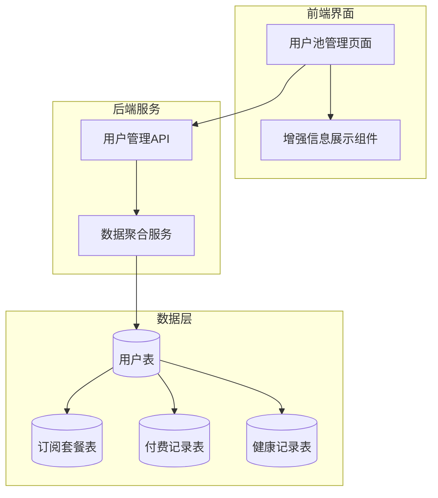

# 用户池管理信息增强设计文档

## 1. 概述

为健康守护微信小程序的管理员端用户池管理功能增加以下信息：
- 用户当前订阅套餐
- 用户总付费金额
- 用户住址信息
- 用户电话信息
- 用户当前病情数据记录

## 2. 需求分析

### 2.1 功能需求
1. **套餐信息显示**: 展示用户当前订阅的10级套餐（贴心关怀型到尊享专家型）
2. **付费信息汇总**: 显示用户总付费金额、付费次数、最近付费时间
3. **地址信息管理**: 显示用户默认服务地址，支持多地址查看
4. **联系信息展示**: 显示手机号（权限控制），紧急联系人信息
5. **健康状况概览**: 显示健康记录数量、主要病情、风险等级

### 2.2 技术需求
- 数据一致性保证
- 响应时间 < 2秒
- 敏感信息脱敏
- 支持分页和筛选

## 3. 系统架构



## 4. 数据库设计

### 4.1 新增表结构

#### 订阅套餐表 (subscription_packages)
```sql
CREATE TABLE `subscription_packages` (
  `id` varchar(50) NOT NULL COMMENT '套餐ID',
  `name` varchar(100) NOT NULL COMMENT '套餐名称',
  `level` int NOT NULL COMMENT '套餐等级(1-10)',
  `price` decimal(10,2) NOT NULL COMMENT '月费价格',
  `services_per_month` int NOT NULL COMMENT '每月服务次数',
  `features` json DEFAULT NULL COMMENT '套餐特性',
  `is_active` tinyint(1) DEFAULT 1 COMMENT '是否启用',
  `create_time` timestamp DEFAULT CURRENT_TIMESTAMP,
  PRIMARY KEY (`id`),
  KEY `idx_level` (`level`)
) ENGINE=InnoDB DEFAULT CHARSET=utf8mb4 COMMENT='订阅套餐配置表';
```

#### 用户订阅表 (user_subscriptions)
```sql
CREATE TABLE `user_subscriptions` (
  `id` varchar(50) NOT NULL COMMENT '订阅ID',
  `user_id` varchar(50) NOT NULL COMMENT '用户ID',
  `package_id` varchar(50) NOT NULL COMMENT '套餐ID',
  `status` enum('active','expired','paused','cancelled') DEFAULT 'active',
  `start_date` date NOT NULL COMMENT '开始日期',
  `end_date` date NOT NULL COMMENT '结束日期',
  `monthly_price` decimal(10,2) NOT NULL COMMENT '月费',
  `services_used` int DEFAULT 0 COMMENT '已使用服务次数',
  `services_remaining` int DEFAULT 0 COMMENT '剩余服务次数',
  `create_time` timestamp DEFAULT CURRENT_TIMESTAMP,
  PRIMARY KEY (`id`),
  KEY `idx_user_id` (`user_id`),
  KEY `idx_status` (`status`),
  CONSTRAINT `fk_subscription_user` FOREIGN KEY (`user_id`) REFERENCES `users` (`id`)
) ENGINE=InnoDB DEFAULT CHARSET=utf8mb4 COMMENT='用户订阅表';
```

#### 付费记录表 (payment_records)
```sql
CREATE TABLE `payment_records` (
  `id` varchar(50) NOT NULL COMMENT '支付记录ID',
  `user_id` varchar(50) NOT NULL COMMENT '用户ID',
  `amount` decimal(10,2) NOT NULL COMMENT '支付金额',
  `payment_method` enum('wechat','alipay','balance') DEFAULT 'wechat',
  `payment_status` enum('pending','success','failed','refunded') DEFAULT 'pending',
  `order_no` varchar(50) NOT NULL COMMENT '订单号',
  `payment_time` timestamp NULL DEFAULT NULL COMMENT '支付时间',
  `create_time` timestamp DEFAULT CURRENT_TIMESTAMP,
  PRIMARY KEY (`id`),
  UNIQUE KEY `uk_order_no` (`order_no`),
  KEY `idx_user_id` (`user_id`),
  KEY `idx_payment_status` (`payment_status`),
  CONSTRAINT `fk_payment_user` FOREIGN KEY (`user_id`) REFERENCES `users` (`id`)
) ENGINE=InnoDB DEFAULT CHARSET=utf8mb4 COMMENT='支付记录表';
```

### 4.2 用户表增强
```sql
ALTER TABLE `users` 
ADD COLUMN `current_subscription_id` varchar(50) DEFAULT NULL COMMENT '当前订阅ID',
ADD COLUMN `subscription_status` enum('none','active','expired','paused') DEFAULT 'none',
ADD COLUMN `last_payment_time` timestamp NULL DEFAULT NULL COMMENT '最后付费时间',
ADD INDEX `idx_subscription_status` (`subscription_status`);
```

## 5. API接口设计

### 5.1 增强用户列表接口
```
GET /api/admin/users/enhanced
```

**请求参数:**
```json
{
  "page": 1,
  "pageSize": 20,
  "keyword": "搜索关键词",
  "status": "active|inactive|frozen",
  "subscriptionStatus": "none|active|expired|paused",
  "sortBy": "totalSpent|lastPayment|registerTime",
  "sortOrder": "asc|desc"
}
```

**响应示例:**
```json
{
  "success": true,
  "data": {
    "users": [
      {
        "id": "user_001",
        "nickname": "张大爷",
        "realName": "张明华",
        "phone": "138****5678",
        "age": 75,
        "gender": "男",
        "status": "active",
        "subscription": {
          "packageName": "健康守护型",
          "level": 3,
          "status": "active",
          "endDate": "2024-09-15",
          "monthlyPrice": 298.00,
          "servicesRemaining": 2
        },
        "payment": {
          "totalSpent": 1490.00,
          "lastPaymentTime": "2024-08-15 14:20:00",
          "paymentCount": 5
        },
        "address": {
          "default": {
            "contactName": "张明华",
            "contactPhone": "13812345678",
            "address": "北京市朝阳区望京街道101号",
            "lastServiceTime": "2024-08-20 09:00:00"
          }
        },
        "health": {
          "recordCount": 45,
          "lastRecordTime": "2024-08-24 08:30:00",
          "riskLevel": "medium",
          "mainConditions": ["高血压", "糖尿病"]
        }
      }
    ],
    "pagination": {
      "current": 1,
      "pageSize": 20,
      "total": 156
    }
  }
}
```

## 6. 前端实现

### 6.1 增强的表格列定义
```javascript
const enhancedColumns = [
  {
    title: '用户信息',
    key: 'userInfo',
    render: (_, record) => (
      <div>
        <div><strong>{record.nickname}</strong></div>
        <div style={{ fontSize: '12px', color: '#666' }}>
          {record.realName} | {record.age}岁 | {record.gender}
        </div>
        <div style={{ fontSize: '12px', color: '#666' }}>
          {record.phone}
        </div>
      </div>
    )
  },
  {
    title: '订阅套餐',
    key: 'subscription',
    render: (_, record) => {
      if (!record.subscription) {
        return <Tag color="default">未订阅</Tag>;
      }
      
      const { subscription } = record;
      const statusColors = {
        active: 'green',
        expired: 'red', 
        paused: 'orange'
      };
      
      return (
        <div>
          <div><strong>{subscription.packageName}</strong> (Lv.{subscription.level})</div>
          <Tag color={statusColors[subscription.status]}>
            {subscription.status === 'active' ? '有效' : 
             subscription.status === 'expired' ? '已过期' : '已暂停'}
          </Tag>
          <div style={{ fontSize: '12px' }}>
            至 {subscription.endDate} | 剩余 {subscription.servicesRemaining} 次
          </div>
        </div>
      );
    }
  },
  {
    title: '付费信息',
    key: 'payment',
    render: (_, record) => (
      <div>
        <div><strong>¥{record.payment.totalSpent}</strong></div>
        <div style={{ fontSize: '12px', color: '#666' }}>
          共 {record.payment.paymentCount} 次付费
        </div>
        <div style={{ fontSize: '12px', color: '#666' }}>
          最近: {record.payment.lastPaymentTime}
        </div>
      </div>
    )
  },
  {
    title: '服务地址',
    key: 'address',
    render: (_, record) => {
      if (!record.address) {
        return <span style={{ color: '#999' }}>未设置</span>;
      }
      
      return (
        <div>
          <div><strong>{record.address.default.contactName}</strong></div>
          <div style={{ fontSize: '12px', color: '#666' }}>
            {record.address.default.contactPhone}
          </div>
          <div style={{ fontSize: '12px', color: '#666' }}>
            {record.address.default.address}
          </div>
        </div>
      );
    }
  },
  {
    title: '健康状况',
    key: 'health',
    render: (_, record) => {
      const riskColors = {
        low: 'green',
        medium: 'orange',
        high: 'red'
      };
      
      return (
        <div>
          <div>
            <Tag color={riskColors[record.health.riskLevel]}>
              {record.health.riskLevel === 'low' ? '低风险' :
               record.health.riskLevel === 'medium' ? '中风险' : '高风险'}
            </Tag>
          </div>
          <div style={{ fontSize: '12px', color: '#666' }}>
            {record.health.recordCount} 条记录
          </div>
          <div style={{ fontSize: '12px', color: '#666' }}>
            {record.health.mainConditions.join(', ')}
          </div>
        </div>
      );
    }
  }
];
```

### 6.2 API调用更新
```javascript
// 在 admin-portal/src/utils/api.js 中添加
export const adminAPI = {
  // 现有接口...
  
  // 获取增强用户列表
  getEnhancedUsers: (params) => api.get('/admin/users/enhanced', { params }),
  
  // 获取用户完整信息
  getUserComplete: (userId) => api.get(`/admin/users/${userId}/complete`),
  
  // 套餐管理接口
  getSubscriptionPackages: () => api.get('/admin/subscription-packages'),
  updateUserSubscription: (userId, subscriptionData) => 
    api.put(`/admin/users/${userId}/subscription`, subscriptionData)
};
```

## 7. 后端实现

### 7.1 增强用户查询模型
```javascript
class EnhancedUserModel {
  static async getEnhancedUsers(params = {}) {
    const {
      page = 1,
      pageSize = 20,
      keyword,
      status,
      subscriptionStatus,
      sortBy = 'register_time',
      sortOrder = 'desc'
    } = params;

    const offset = (page - 1) * pageSize;
    let whereConditions = [];
    let queryParams = [];

    // 构建查询条件
    if (keyword) {
      whereConditions.push(`(u.nickname LIKE ? OR u.real_name LIKE ? OR u.phone LIKE ?)`);
      const keywordPattern = `%${keyword}%`;
      queryParams.push(keywordPattern, keywordPattern, keywordPattern);
    }

    if (status) {
      whereConditions.push('u.status = ?');
      queryParams.push(status);
    }

    if (subscriptionStatus) {
      whereConditions.push('u.subscription_status = ?');
      queryParams.push(subscriptionStatus);
    }

    const whereClause = whereConditions.length > 0 
      ? `WHERE ${whereConditions.join(' AND ')}` 
      : '';

    const sql = `
      SELECT 
        u.*,
        sp.name as package_name,
        sp.level as package_level,
        us.status as sub_status,
        us.end_date as sub_end_date,
        us.monthly_price,
        us.services_remaining,
        ua.contact_name as addr_contact_name,
        ua.contact_phone as addr_contact_phone,
        ua.address as addr_address,
        ua.last_visit as addr_last_visit,
        (SELECT COUNT(*) FROM health_records WHERE user_id = u.id) as health_count,
        (SELECT MAX(record_time) FROM health_records WHERE user_id = u.id) as last_health_time,
        (SELECT SUM(amount) FROM payment_records WHERE user_id = u.id AND payment_status = 'success') as total_spent,
        (SELECT MAX(payment_time) FROM payment_records WHERE user_id = u.id AND payment_status = 'success') as last_payment_time,
        (SELECT COUNT(*) FROM payment_records WHERE user_id = u.id AND payment_status = 'success') as payment_count
      FROM users u
      LEFT JOIN user_subscriptions us ON u.current_subscription_id = us.id
      LEFT JOIN subscription_packages sp ON us.package_id = sp.id
      LEFT JOIN user_addresses ua ON u.id = ua.user_id AND ua.is_default = 1
      ${whereClause}
      ORDER BY u.${sortBy} ${sortOrder}
      LIMIT ? OFFSET ?
    `;

    queryParams.push(pageSize, offset);
    const users = await query(sql, queryParams);
    
    // 获取健康状况详情
    const enrichedUsers = await Promise.all(
      users.map(async (user) => {
        const healthDetails = await this.getHealthSummary(user.id);
        
        return {
          id: user.id,
          nickname: user.nickname,
          realName: user.real_name,
          phone: user.phone,
          age: user.age,
          gender: user.gender,
          status: user.status,
          registerTime: user.register_time,
          subscription: user.package_name ? {
            packageName: user.package_name,
            level: user.package_level,
            status: user.sub_status,
            endDate: user.sub_end_date,
            monthlyPrice: parseFloat(user.monthly_price || 0),
            servicesRemaining: user.services_remaining || 0
          } : null,
          payment: {
            totalSpent: parseFloat(user.total_spent || 0),
            lastPaymentTime: user.last_payment_time,
            paymentCount: user.payment_count || 0
          },
          address: user.addr_address ? {
            default: {
              contactName: user.addr_contact_name,
              contactPhone: user.addr_contact_phone,
              address: user.addr_address,
              lastServiceTime: user.addr_last_visit
            }
          } : null,
          health: {
            recordCount: user.health_count || 0,
            lastRecordTime: user.last_health_time,
            riskLevel: healthDetails.riskLevel,
            mainConditions: healthDetails.conditions
          }
        };
      })
    );

    // 获取总数
    const countSql = `SELECT COUNT(*) as total FROM users u ${whereClause}`;
    const countParams = queryParams.slice(0, -2);
    const countResult = await query(countSql, countParams);

    return {
      users: enrichedUsers,
      pagination: {
        current: page,
        pageSize,
        total: countResult[0].total
      }
    };
  }

  static async getHealthSummary(userId) {
    // 获取主要病情
    const conditionsSql = `
      SELECT DISTINCT JSON_UNQUOTE(JSON_EXTRACT(value, '$.condition')) as condition
      FROM health_records 
      WHERE user_id = ? AND type = 'condition'
      ORDER BY record_time DESC
      LIMIT 3
    `;
    const conditions = await query(conditionsSql, [userId]);

    // 简化风险评估
    const riskLevel = conditions.length > 2 ? 'high' : 
                      conditions.length > 0 ? 'medium' : 'low';

    return {
      riskLevel,
      conditions: conditions.map(c => c.condition).filter(Boolean)
    };
  }
}
```

### 7.2 路由实现
```javascript
// server/routes/admin.js
router.get('/users/enhanced', async (req, res) => {
  try {
    const result = await EnhancedUserModel.getEnhancedUsers(req.query);
    
    res.json({
      success: true,
      data: result
    });
  } catch (error) {
    console.error('获取增强用户列表失败:', error);
    res.status(500).json({
      success: false,
      message: '获取用户列表失败'
    });
  }
});
```

## 8. 数据库初始化

### 8.1 套餐数据初始化
```sql
-- 插入10级套餐配置
INSERT INTO subscription_packages (id, name, level, price, services_per_month, is_active) VALUES
('pkg_001', '贴心关怀型', 1, 98.00, 1, 1),
('pkg_002', '基础保障型', 2, 168.00, 2, 1),
('pkg_003', '健康守护型', 3, 298.00, 4, 1),
('pkg_004', '专业护理型', 4, 498.00, 6, 1),
('pkg_005', '贴心陪护型', 5, 798.00, 8, 1),
('pkg_006', '高级护理型', 6, 1280.00, 12, 1),
('pkg_007', '专家指导型', 7, 1880.00, 16, 1),
('pkg_008', '专属护理型', 8, 2280.00, 20, 1),
('pkg_009', '全程陪护型', 9, 2680.00, 25, 1),
('pkg_010', '尊享专家型', 10, 2980.00, 30, 1);
```

## 9. 压力测试工具

### 9.1 用户生成器
```javascript
// load-testing/src/enhanced-user-generator.js
const EnhancedUserGenerator = {
  async generateUsers(count = 50) {
    console.log(`开始生成 ${count} 个测试用户...`);
    
    const packages = await this.getPackages();
    
    for (let i = 0; i < count; i++) {
      const userData = this.createRandomUserData(packages);
      
      try {
        // 创建用户
        const userId = await this.createUser(userData);
        
        // 创建订阅
        if (userData.hasSubscription) {
          await this.createSubscription(userId, userData.packageId);
        }
        
        // 创建付费记录
        await this.createPayments(userId, userData.paymentHistory);
        
        // 创建地址
        await this.createAddress(userId, userData.address);
        
        // 创建健康记录
        await this.createHealthRecords(userId, userData.healthData);
        
        console.log(`✅ 用户 ${i + 1}/${count} 创建完成`);
      } catch (error) {
        console.error(`❌ 用户 ${i + 1} 创建失败:`, error.message);
      }
    }
    
    console.log(`🎉 测试用户生成完成，共 ${count} 个用户`);
  },

  createRandomUserData(packages) {
    const names = ['张明华', '王丽华', '李秀英', '赵建国', '陈志强'];
    const conditions = ['高血压', '糖尿病', '冠心病', '脑梗', '关节炎'];
    
    const name = names[Math.floor(Math.random() * names.length)];
    const hasSubscription = Math.random() > 0.3;
    const packageLevel = Math.floor(Math.random() * 10) + 1;
    
    return {
      realName: name,
      nickname: name.charAt(0) + (Math.random() > 0.5 ? '大爷' : '奶奶'),
      phone: `138${Math.floor(Math.random() * 90000000) + 10000000}`,
      age: Math.floor(Math.random() * 20) + 60,
      gender: Math.random() > 0.6 ? '男' : '女',
      hasSubscription,
      packageId: hasSubscription ? packages[packageLevel - 1].id : null,
      paymentHistory: this.generatePaymentHistory(),
      address: this.generateAddress(),
      healthData: this.generateHealthData(conditions)
    };
  },

  generatePaymentHistory() {
    const count = Math.floor(Math.random() * 10) + 1;
    const history = [];
    
    for (let i = 0; i < count; i++) {
      history.push({
        amount: Math.floor(Math.random() * 2000) + 100,
        paymentTime: new Date(Date.now() - Math.random() * 365 * 24 * 60 * 60 * 1000)
      });
    }
    
    return history;
  },

  generateAddress() {
    const cities = ['北京市', '上海市', '广州市', '深圳市', '杭州市'];
    const streets = ['中山路', '人民路', '建设路', '解放路', '胜利路'];
    
    return {
      contactName: this.realName,
      contactPhone: this.phone,
      address: `${cities[Math.floor(Math.random() * cities.length)]}朝阳区${streets[Math.floor(Math.random() * streets.length)]}${Math.floor(Math.random() * 200) + 1}号`
    };
  },

  generateHealthData(conditions) {
    const count = Math.floor(Math.random() * 3) + 1;
    return conditions.sort(() => 0.5 - Math.random()).slice(0, count);
  }
};

module.exports = EnhancedUserGenerator;
```

## 10. 实施计划

### 阶段一：数据库设计 (1天)
1. 创建新数据表
2. 初始化套餐数据
3. 数据库迁移脚本

### 阶段二：后端开发 (2天)
1. 实现增强用户查询API
2. 开发套餐管理功能
3. 完善数据聚合逻辑

### 阶段三：前端开发 (2天)
1. 更新用户池管理页面
2. 开发信息展示组件
3. 实现数据交互

### 阶段四：测试优化 (2天)
1. 功能测试和调试
2. 性能优化
3. 压力测试工具开发

### 阶段五：部署验证 (1天)
1. 生产环境部署
2. 数据迁移验证
3. 用户验收测试