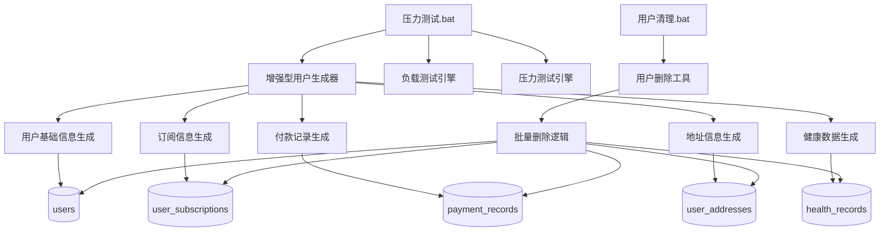
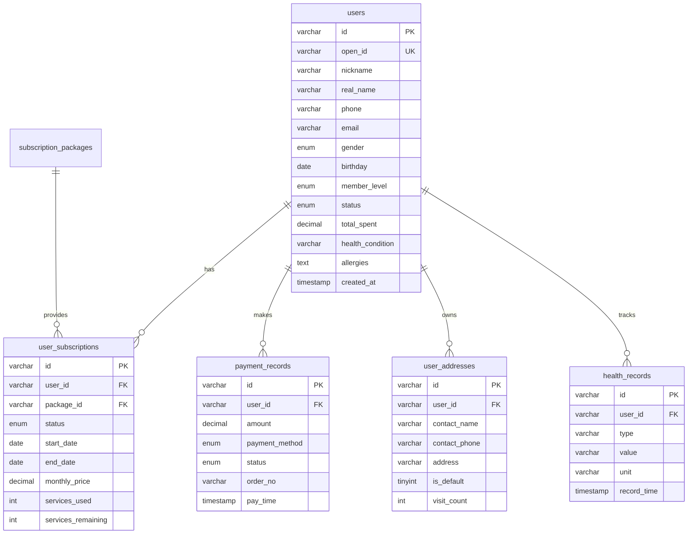
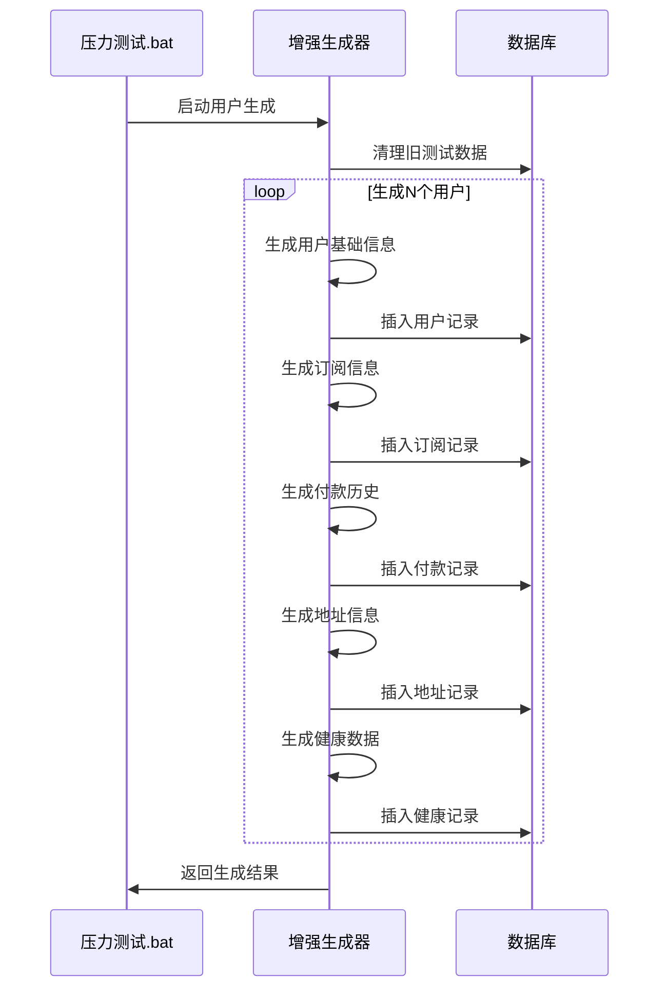
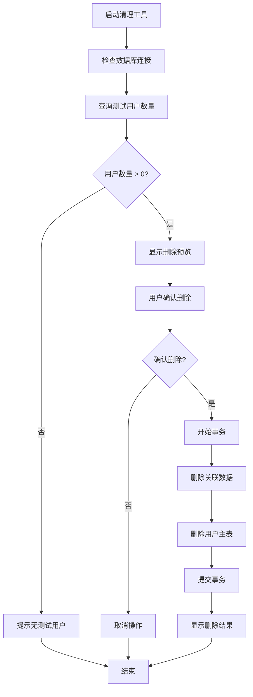

# 用户压力测试工具设计文档

## 1. 概述

本设计文档描述了对现有压力测试工具的增强改进，主要包括两个核心功能：
1. **增强型用户生成器** - 在现有基础上添加随机订阅信息、付款信息、地址信息、电话信息和健康状况数据
2. **用户清理工具** - 提供安全的测试用户删除功能

### 1.1 业务目标

- 提供更真实的测试数据生成，支持完整的用户生命周期模拟
- 增加对订阅套餐、付费记录、地址管理等新功能的测试支持  
- 提供便捷的测试环境清理工具，支持开发和测试流程

### 1.2 技术目标

- 扩展现有的 `tools/压力测试.bat` 脚本，保持向后兼容
- 新增独立的用户删除工具 `tools/用户清理.bat`
- 确保生成的测试数据符合真实业务场景和数据约束

## 2. 架构设计

### 2.1 工具架构图



### 2.2 数据模型关系



## 3. 增强型用户生成器功能设计

### 3.1 数据生成策略

#### 3.1.1 用户基础信息增强

```typescript
interface EnhancedUserData {
    // 原有字段
    openId: string;
    nickname: string;
    realName: string;
    phone: string;
    gender: '男' | '女';
    memberLevel: 'regular' | 'vip';
    
    // 新增字段
    email: string;           // 随机邮箱地址
    birthday: Date;          // 随机生成的合理年龄
    healthCondition: string; // 健康状况描述
    allergies: string;       // 过敏史信息
    emergencyContact: string; // 紧急联系人
    emergencyRelation: string; // 紧急联系人关系
}
```

#### 3.1.2 订阅信息生成规则

- **订阅概率分布**：70%活跃订阅，20%过期订阅，10%取消订阅
- **套餐等级分布**：60%基础套餐，30%中级套餐，10%高级套餐
- **订阅时长**：随机1-12个月，符合真实用户行为模式

#### 3.1.3 付款记录生成规则

- **付款频次**：每个用户0-8次历史付款记录
- **金额范围**：基于订阅套餐价格的合理波动（±20%）
- **支付方式分布**：微信支付60%，支付宝30%，银行卡10%
- **支付状态分布**：95%成功，3%失败，2%退款

#### 3.1.4 地址信息生成规则

- **地址数量**：每个用户1-3个地址
- **地址分布**：覆盖主要城市和地区
- **默认地址**：确保每个用户有且仅有一个默认地址
- **服务历史**：随机生成0-20次历史服务记录

#### 3.1.5 健康数据生成规则

- **数据类型**：血压、心率、血糖、体重、体温等常见指标
- **数据范围**：基于医学正常值范围和异常值概率分布
- **记录频次**：模拟不同用户的监测习惯（日常监测vs偶尔监测）

### 3.2 生成器实现流程



## 4. 用户清理工具设计

### 4.1 清理工具功能

#### 4.1.1 安全删除机制

- **标识符检查**：只删除open_id以'wx_test_'开头的测试用户
- **级联删除**：自动删除关联的所有数据表记录
- **事务保护**：确保删除操作的原子性
- **删除确认**：提供交互式确认和批量确认选项

#### 4.1.2 删除范围

```sql
-- 删除的表和顺序
1. health_records     -- 健康记录
2. payment_records    -- 付款记录  
3. user_subscriptions -- 订阅记录
4. user_addresses     -- 地址记录
5. users              -- 用户主表（最后删除）
```

### 4.2 清理工具实现



## 5. 工具界面设计

### 5.1 压力测试工具增强界面

```
==================
Health Guard Enhanced Load Test
==================

Current Status:
✅ Server: Running (http://localhost:3000)
✅ Database: Connected (health_guard_db)
📊 Test Users: 156 found

==================
Test Options
==================

[1] Generate Enhanced Test Users (50 users)
    ↳ Includes: Subscriptions, Payments, Addresses, Health Data

[2] Generate Basic Test Users (50 users)  
    ↳ Legacy mode: Basic user info only

[3] Run Load Test (5 minutes)
[4] Run Stress Test (3 minutes)

[8] User Management
    ↳ View/Delete test users

[9] Troubleshooting
[0] Exit

Select option (1-9, 0): _
```

### 5.2 用户清理工具界面

```
==================
Health Guard User Cleanup Tool
==================

🔍 Scanning test users...

Found Test Users:
📊 Total Users: 156
💳 Payment Records: 453  
📦 Subscriptions: 127
🏠 Addresses: 298
💊 Health Records: 1,247

==================
Cleanup Options  
==================

[1] Delete All Test Users
    ⚠️  WARNING: This will permanently delete all test data

[2] Delete Users by Date Range
    ↳ Select creation date range

[3] Delete Specific User Count
    ↳ Delete oldest N test users

[4] Preview Deletion (Dry Run)
    ↳ Show what would be deleted without actual deletion

[0] Exit

Select option (1-4, 0): _
```

## 6. 测试策略

### 6.1 单元测试覆盖

- **数据生成器测试**：验证生成数据的格式和约束
- **删除工具测试**：验证安全删除逻辑
- **数据库操作测试**：验证事务处理和错误恢复

### 6.2 集成测试场景

- **完整生成流程测试**：生成用户→验证数据完整性
- **删除流程测试**：删除用户→验证数据清理完整性
- **并发操作测试**：多进程同时操作的安全性

### 6.3 性能测试

- **生成性能**：50用户生成时间 < 30秒
- **删除性能**：批量删除响应时间 < 10秒
- **内存使用**：工具运行内存占用 < 100MB

## 7. 实现细节

### 7.1 增强生成器核心模块

#### 7.1.1 数据生成器 (enhanced-user-generator.js)

```javascript
class EnhancedUserGenerator {
  // 中文姓名生成
  static generateChineseName() {
    const surnames = ['王', '李', '张', '刘', '陈', '杨', '黄', '赵', '吴', '周'];
    const givenNames = ['伟', '芳', '娜', '敏', '静', '丽', '强', '磊', '军', '洋'];
    return surnames[Math.floor(Math.random() * surnames.length)] + 
           givenNames[Math.floor(Math.random() * givenNames.length)];
  }

  // 手机号生成
  static generatePhone() {
    const prefixes = ['130', '131', '132', '133', '134', '135', '136', '137', '138', '139',
                     '150', '151', '152', '153', '155', '156', '157', '158', '159',
                     '180', '181', '182', '183', '184', '185', '186', '187', '188', '189'];
    return prefixes[Math.floor(Math.random() * prefixes.length)] + 
           Math.floor(Math.random() * 100000000).toString().padStart(8, '0');
  }

  // 邮箱生成
  static generateEmail(realName) {
    const domains = ['qq.com', '163.com', '126.com', 'gmail.com', 'hotmail.com'];
    const username = `${realName.toLowerCase()}${Math.floor(Math.random() * 1000)}`;
    return `${username}@${domains[Math.floor(Math.random() * domains.length)]}`;
  }

  // 健康状况生成
  static generateHealthCondition() {
    const conditions = [
      '健康', '轻微高血压', '糖尿病前期', '颈椎病', '腰椎间盘突出',
      '慢性胃炎', '脂肪肝', '高血脂', '失眠', '焦虑症'
    ];
    const probability = Math.random();
    if (probability < 0.6) return '健康';
    if (probability < 0.9) return conditions[Math.floor(Math.random() * conditions.length)];
    return conditions.slice(1, 4).join(', '); // 多个病症
  }

  // 过敏史生成
  static generateAllergies() {
    const allergies = ['无', '花粉过敏', '海鲜过敏', '药物过敏', '尘螨过敏', '牛奶过敏'];
    return allergies[Math.floor(Math.random() * allergies.length)];
  }
}
```

#### 7.1.2 订阅数据生成

```javascript
class SubscriptionGenerator {
  static async generateSubscription(userId, packageTypes) {
    const statusDistribution = {
      'active': 0.7,
      'expired': 0.2, 
      'cancelled': 0.1
    };
    
    const status = this.weightedRandom(statusDistribution);
    const packageType = packageTypes[Math.floor(Math.random() * packageTypes.length)];
    
    const startDate = new Date();
    startDate.setMonth(startDate.getMonth() - Math.floor(Math.random() * 12));
    
    const endDate = new Date(startDate);
    endDate.setMonth(endDate.getMonth() + Math.floor(Math.random() * 6 + 1));
    
    return {
      id: `sub_${this.generateId()}`,
      userId,
      packageId: packageType.id,
      status,
      startDate,
      endDate,
      monthlyPrice: packageType.price,
      servicesUsed: Math.floor(Math.random() * packageType.servicesPerMonth),
      servicesRemaining: packageType.servicesPerMonth - Math.floor(Math.random() * packageType.servicesPerMonth)
    };
  }
}
```

#### 7.1.3 付款记录生成

```javascript
class PaymentGenerator {
  static generatePaymentHistory(userId, subscriptionData) {
    const paymentCount = Math.floor(Math.random() * 8) + 1;
    const payments = [];
    
    for (let i = 0; i < paymentCount; i++) {
      const payment = {
        id: `pay_${this.generateId()}`,
        userId,
        amount: this.generateAmount(subscriptionData.monthlyPrice),
        paymentMethod: this.weightedRandom({
          'wechat': 0.6,
          'alipay': 0.3,
          'bank_card': 0.1
        }),
        status: this.weightedRandom({
          'success': 0.95,
          'failed': 0.03,
          'refunded': 0.02
        }),
        orderNo: `ORD_${this.generateId()}`,
        payTime: this.generateRandomDate()
      };
      payments.push(payment);
    }
    
    return payments;
  }
  
  static generateAmount(basePrice) {
    // 基于基础价格的±20%波动
    const variation = (Math.random() - 0.5) * 0.4;
    return parseFloat((basePrice * (1 + variation)).toFixed(2));
  }
}
```

### 7.2 用户清理工具实现

#### 7.2.1 安全删除类 (user-cleanup.js)

```javascript
class UserCleanupTool {
  static async deleteTestUsers(options = {}) {
    const { dryRun = false, userLimit = null, dateRange = null } = options;
    
    return await this.executeInTransaction(async (connection) => {
      // 1. 查询待删除用户
      const users = await this.getTestUsers(connection, { userLimit, dateRange });
      
      if (users.length === 0) {
        return { deleted: 0, message: '未找到测试用户' };
      }
      
      if (dryRun) {
        return await this.previewDeletion(connection, users);
      }
      
      // 2. 级联删除关联数据
      const userIds = users.map(u => u.id);
      const deletionStats = {};
      
      // 删除健康记录
      deletionStats.healthRecords = await this.deleteHealthRecords(connection, userIds);
      
      // 删除付款记录
      deletionStats.paymentRecords = await this.deletePaymentRecords(connection, userIds);
      
      // 删除订阅记录
      deletionStats.subscriptions = await this.deleteSubscriptions(connection, userIds);
      
      // 删除地址记录
      deletionStats.addresses = await this.deleteAddresses(connection, userIds);
      
      // 删除用户主表
      deletionStats.users = await this.deleteUsers(connection, userIds);
      
      return {
        deleted: users.length,
        stats: deletionStats,
        userIds
      };
    });
  }
  
  static async getTestUsers(connection, options) {
    let sql = `SELECT id, nickname, real_name, created_at 
               FROM users WHERE open_id LIKE 'wx_test_%'`;
    const params = [];
    
    if (options.dateRange) {
      sql += ` AND created_at BETWEEN ? AND ?`;
      params.push(options.dateRange.start, options.dateRange.end);
    }
    
    sql += ` ORDER BY created_at ASC`;
    
    if (options.userLimit) {
      sql += ` LIMIT ?`;
      params.push(options.userLimit);
    }
    
    const [users] = await connection.execute(sql, params);
    return users;
  }
}
```

### 7.3 批处理脚本增强

#### 7.3.1 压力测试.bat 增强

```batch
:ENHANCED_USER_GEN
echo.
echo [ENHANCED] Generating enhanced test users...
echo This will create users with full profile data:
echo  ✓ Basic info (name, phone, email)
echo  ✓ Subscription records
echo  ✓ Payment history
echo  ✓ Address information  
echo  ✓ Health data
echo.
set /p USER_COUNT=Enter number of users to generate (default 50): 
if "%USER_COUNT%"=="" set USER_COUNT=50

set /p CONFIRM=Generate %USER_COUNT% enhanced users? (y/N): 
if /i "%CONFIRM%" neq "y" (
    echo User generation cancelled
    goto :MAIN_MENU
)

echo Generating %USER_COUNT% enhanced users...
node src/enhanced-user-generator.js --count=%USER_COUNT% --mode=enhanced

if %errorlevel% equ 0 (
    echo [SUCCESS] %USER_COUNT% enhanced users generated!
    echo.
    echo Generated data includes:
    echo  👤 Users: %USER_COUNT%
    echo  📦 Subscriptions: Random assignments
    echo  💳 Payment records: Historical data
    echo  🏠 Addresses: 1-3 per user
    echo  💊 Health records: Baseline data
) else (
    echo [ERROR] Enhanced user generation failed
    echo Check database connection and table structure
)

pause
goto :MAIN_MENU
```

#### 7.3.2 用户清理.bat 新建

```batch
@echo off
setlocal EnableDelayedExpansion

:: 健康守护系统 - 用户清理工具
:: ===============================

echo.
echo ===============================
echo Health Guard User Cleanup Tool
echo ===============================
echo.

:: 设置目录
set "WORKSPACE_ROOT=%~dp0.."
set "LOAD_TEST_DIR=%WORKSPACE_ROOT%\load-testing"

echo Working Directory: %WORKSPACE_ROOT%
echo.

:: 检查环境
echo Checking environment...
node --version >nul 2>&1
if %errorlevel% neq 0 (
    echo [ERROR] Node.js not found
    pause
    exit /b 1
)

cd /d "%LOAD_TEST_DIR%"

:: 检查数据库连接
echo Checking database connection...
node -e "require('./src/database-test.js')" >nul 2>&1
if %errorlevel% equ 0 (
    echo [SUCCESS] Database connected
) else (
    echo [ERROR] Database connection failed
    echo Please ensure MySQL is running
    pause
    exit /b 1
)

:: 获取测试用户统计
echo.
echo Scanning test users...
node src/user-cleanup.js --scan-only

:CLEANUP_MENU
echo.
echo ==================
echo  Cleanup Options
echo ==================
echo.
echo   [1] Delete All Test Users
echo   [2] Delete by Date Range
echo   [3] Delete Specific Count
echo   [4] Preview Deletion (Dry Run)
echo.
echo   [0] Exit

echo.
set /p CHOICE=Select option: 

if "%CHOICE%"=="0" exit /b 0

if "%CHOICE%"=="1" (
    echo.
    echo [WARNING] This will delete ALL test users and related data
    set /p CONFIRM=Are you sure? Type 'DELETE' to confirm: 
    if /i "!CONFIRM!"=="DELETE" (
        node src/user-cleanup.js --delete-all
    ) else (
        echo Deletion cancelled
    )
    pause
    goto :CLEANUP_MENU
)

if "%CHOICE%"=="4" (
    echo.
    echo [DRY RUN] Preview what would be deleted...
    node src/user-cleanup.js --dry-run
    pause
    goto :CLEANUP_MENU
)

echo [ERROR] Invalid selection
goto :CLEANUP_MENU
```

## 8. 配置参数

### 8.1 环境配置 (.env)

```env
# 数据库配置
DB_HOST=localhost
DB_PORT=3306
DB_USERNAME=root
DB_PASSWORD=abcd1234!
DB_DATABASE=health_guard_db

# 生成器配置
DEFAULT_USER_COUNT=50
MAX_USER_COUNT=1000
ENABLE_ENHANCED_GENERATION=true

# 性能配置
BATCH_SIZE=10
PARALLEL_WORKERS=4
TRANSACTION_TIMEOUT=30000

# 安全配置
TEST_USER_PREFIX=wx_test_
ALLOW_PRODUCTION_CLEANUP=false
REQUIRE_DELETION_CONFIRMATION=true
```

### 8.2 生成器配置 (generator-config.json)

```json
{
  "userGeneration": {
    "genderDistribution": { "男": 0.52, "女": 0.48 },
    "memberLevelDistribution": { "regular": 0.8, "vip": 0.2 },
    "ageRange": { "min": 18, "max": 80 }
  },
  "subscriptionGeneration": {
    "statusDistribution": {
      "active": 0.7,
      "expired": 0.2,
      "cancelled": 0.1
    },
    "packageDistribution": {
      "basic": 0.6,
      "premium": 0.3,
      "vip": 0.1
    }
  },
  "paymentGeneration": {
    "recordsPerUser": { "min": 1, "max": 8 },
    "methodDistribution": {
      "wechat": 0.6,
      "alipay": 0.3,
      "bank_card": 0.1
    },
    "statusDistribution": {
      "success": 0.95,
      "failed": 0.03,
      "refunded": 0.02
    }
  },
  "addressGeneration": {
    "addressesPerUser": { "min": 1, "max": 3 },
    "cityDistribution": {
      "北京市": 0.15,
      "上海市": 0.15,
      "深圳市": 0.12,
      "广州市": 0.10,
      "杭州市": 0.08,
      "其他": 0.40
    }
  },
  "healthGeneration": {
    "recordTypes": [
      "blood_pressure", "heart_rate", "blood_sugar", 
      "weight", "height", "temperature"
    ],
    "recordsPerUser": { "min": 5, "max": 50 },
    "timeSpanMonths": 12
  }
}
```

## 9. 部署与运维

### 9.1 安装部署

```bash
# 1. 更新工具脚本
cp tools/压力测试.bat tools/压力测试_backup.bat
cp enhanced/压力测试.bat tools/
cp enhanced/用户清理.bat tools/

# 2. 安装新依赖
cd load-testing
npm install faker chinese-random-name moment

# 3. 创建配置文件
cp config/generator-config.example.json config/generator-config.json
cp .env.example .env

# 4. 数据库迁移
node scripts/enhance-database-tables.js
```

### 9.2 运维监控

- **日志记录**：所有操作记录到 `logs/user-management.log`
- **性能监控**：生成和删除操作的执行时间
- **错误处理**：详细错误信息和恢复建议
- **数据验证**：定期验证数据完整性和约束