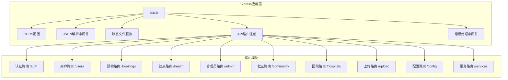
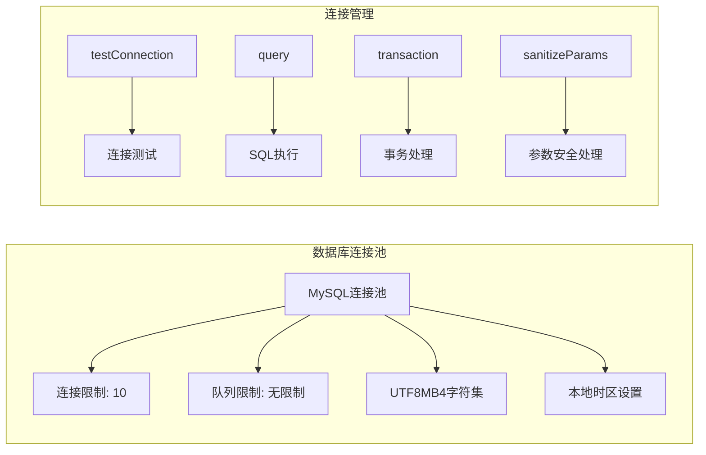
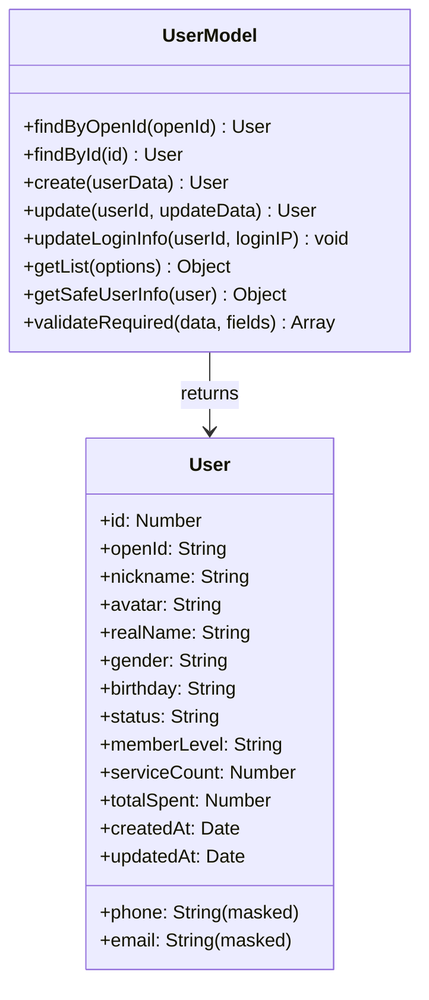

# 健康守护微信小程序后端服务完整代码说明

## 1. 项目概述

### 技术架构
健康守护微信小程序后端服务基于Node.js + Express + MySQL技术栈构建，采用RESTful API设计模式，提供完整的健康管理、用户管理、预约服务等功能模块。

### 核心特性
- **模块化架构**：路由、模型、中间件分离设计
- **JWT认证**：用户认证和权限管理
- **数据脱敏**：敏感信息安全处理
- **事务支持**：数据一致性保障
- **错误处理**：统一错误响应机制

## 2. 服务器应用架构

### 主应用配置 (app.js)



### 服务启动配置
- **端口配置**：默认3000，支持环境变量PORT
- **API前缀**：开发环境/v1，测试环境/api
- **CORS策略**：支持本地开发和微信服务域名
- **请求限制**：JSON请求体限制10MB
- **健康检查**：GET /health端点

## 3. 数据库架构设计

### 数据库连接配置 (config/database.js)



### 核心数据库函数
- **query(sql, params)**：安全的SQL查询执行
- **transaction(callback)**：事务处理包装器
- **testConnection()**：数据库连接状态检测
- **initDatabase()**：数据库初始化
- **sanitizeParams(params)**：参数undefined转null处理

## 4. 数据模型架构

### 用户模型 (models/User.js)



### 增强用户模型 (models/EnhancedUser.js)
包含订阅信息、支付记录、地址信息、健康数据的完整用户模型，支持复杂查询和数据关联。

## 5. API接口完整文档

### 5.1 认证模块 (routes/auth.js)

#### POST /v1/auth/register
**功能**：用户注册
**请求参数**：
```json
{
  "openId": "string (必填)",
  "nickname": "string (必填)",
  "avatar": "string (可选)",
  "phone": "string (可选)",
  "email": "string (可选)",
  "realName": "string (可选)",
  "gender": "string (可选)",
  "birthday": "string (可选)"
}
```

**响应格式**：
```json
{
  "code": 200,
  "success": true,
  "message": "注册成功",
  "data": {
    "token": "JWT_TOKEN",
    "user": {
      "id": "number",
      "openId": "string",
      "nickname": "string",
      "avatar": "string",
      "memberLevel": "regular"
    }
  }
}
```

#### POST /v1/auth/login
**功能**：用户登录
**请求参数**：
```json
{
  "openId": "string (必填)",
  "nickname": "string (新用户必填)",
  "avatar": "string (可选)"
}
```

#### POST /v1/auth/wechat-login
**功能**：微信授权登录
**请求参数**：
```json
{
  "code": "string (必填，微信授权码)",
  "userInfo": {
    "nickName": "string",
    "avatarUrl": "string",
    "gender": "number"
  }
}
```

#### GET /v1/auth/user-info
**功能**：获取当前用户信息
**认证**：Bearer Token
**响应**：当前用户完整信息

#### PUT /v1/auth/user-info
**功能**：更新用户信息
**认证**：Bearer Token
**请求参数**：
```json
{
  "realName": "string (必填)",
  "phone": "string (手机号格式验证)",
  "email": "string (邮箱格式验证)",
  "age": "number",
  "gender": "string",
  "birthday": "string",
  "emergencyContact": "string",
  "emergencyRelation": "string"
}
```

### 5.2 用户管理模块 (routes/users.js)

#### GET /v1/users/profile
**功能**：获取用户档案信息
**认证**：Bearer Token
**响应字段**：
- id, openid, nickname, realName, avatar
- phone, email, age, gender, birthday
- memberLevel, registerTime, lastVisit

#### PUT /v1/users/profile
**功能**：更新用户档案
**认证**：Bearer Token
**数据验证**：
- 手机号：正则 `/^1[3-9]\d{9}$/`
- 邮箱：正则 `/^[^\s@]+@[^\s@]+\.[^\s@]+$/`
- 年龄：0-150范围
- 性别：male/female枚举

#### GET /v1/users/family-members
**功能**：获取家庭成员列表
**认证**：Bearer Token
**响应数据**：成员信息数组，包含关系、年龄、性别、医疗史等

#### POST /v1/users/family-members
**功能**：添加家庭成员
**请求参数**：
```json
{
  "name": "string (必填)",
  "relation": "string (必填，father/mother/spouse/child/sibling/grandparent/other)",
  "age": "number (必填，0-150)",
  "gender": "string (必填，male/female)",
  "phone": "string (可选)",
  "idCard": "string (可选)",
  "medicalHistory": "string (可选)",
  "allergies": "string (可选)"
}
```

#### PUT /v1/users/family-members/:id
**功能**：更新家庭成员信息
**权限验证**：只能修改属于当前用户的成员

#### DELETE /v1/users/family-members/:id
**功能**：删除家庭成员
**权限验证**：只能删除属于当前用户的成员

#### GET /v1/users/addresses
**功能**：获取用户地址列表
**响应字段**：地址详情、默认地址标识

#### POST /v1/users/addresses
**功能**：添加新地址
**请求参数**：
```json
{
  "province": "string (必填)",
  "city": "string (必填)",
  "district": "string (必填)",
  "detail": "string (必填)",
  "contactName": "string (必填)",
  "contactPhone": "string (必填)",
  "isDefault": "boolean (可选)"
}
```

### 5.3 预约管理模块 (routes/bookings.js)

#### POST /v1/bookings
**功能**：创建服务预约
**认证**：Bearer Token
**请求参数**：
```json
{
  "serviceType": "string (必填，basic_health/comprehensive_health/home_care/emergency_care)",
  "serviceDate": "string (必填，YYYY-MM-DD格式)",
  "serviceTime": "string (必填，HH:MM格式)",
  "addressId": "number (必填)",
  "notes": "string (可选)"
}
```

**业务逻辑**：
- 服务类型价格映射：基础健康100元，全面健康200元，居家护理150元，紧急护理300元
- 日期验证：不能选择过去时间
- 地址验证：确保地址属于当前用户
- 状态初始化：pending状态

#### GET /v1/bookings
**功能**：获取用户预约列表
**查询参数**：
- page: 页码（默认1）
- limit: 每页数量（默认20，最大100）
- status: 状态筛选（all/pending/confirmed/in_progress/completed/cancelled）

**响应格式**：
```json
{
  "data": {
    "bookings": [...],
    "pagination": {
      "page": 1,
      "limit": 20,
      "total": 100,
      "totalPages": 5
    }
  }
}
```

#### GET /v1/bookings/:id
**功能**：获取预约详情
**权限验证**：只能查看属于自己的预约

#### PUT /v1/bookings/:id
**功能**：更新预约信息
**业务规则**：
- 已完成或已取消的预约不能修改
- 只能修改serviceDate、serviceTime、notes字段
- 权限验证：只能修改属于自己的预约

#### DELETE /v1/bookings/:id
**功能**：取消预约
**业务规则**：
- 只能取消pending或confirmed状态的预约
- 状态更新为cancelled
- 记录取消时间

### 5.4 健康管理模块 (routes/health.js)

#### GET /v1/health/records
**功能**：获取健康记录列表
**查询参数**：
- page, limit: 分页参数
- type: 记录类型筛选（all/bloodPressure/bloodSugar/heartRate/weight/temperature）

**响应字段**：
- id, type, value, unit, status, notes
- recordTime: 记录时间
- createdAt: 创建时间

#### POST /v1/health/records
**功能**：添加健康记录
**请求参数**：
```json
{
  "type": "string (必填，bloodPressure/bloodSugar/heartRate/weight/temperature)",
  "value": "string/number (必填)",
  "unit": "string (可选)",
  "status": "string (可选，normal/abnormal/warning)",
  "notes": "string (可选)",
  "recordTime": "string (可选，ISO格式)"
}
```

**技术实现**：
- UUID主键生成
- 时间格式转换：ISO -> MySQL datetime
- 默认状态：normal
- 自动时间戳：未提供recordTime时使用当前时间

#### GET /v1/health/metrics
**功能**：获取健康指标统计
**查询参数**：
- days: 统计天数（默认7天，最大365天）

**响应格式**：
```json
{
  "data": {
    "metrics": [
      {
        "type": "bloodPressure",
        "latestValue": "120/80",
        "unit": "mmHg",
        "status": "normal",
        "records": [
          {
            "value": "120/80",
            "date": "2024-01-01",
            "status": "normal"
          }
        ]
      }
    ]
  }
}
```

#### GET /v1/health/suggestions
**功能**：获取健康建议
**算法逻辑**：
- 基于用户近30天健康记录
- 异常数据触发特定建议
- 个性化建议生成
- 优先级分类：normal/high/urgent

### 5.5 管理员模块 (routes/admin.js)

#### POST /v1/admin/login
**功能**：管理员登录
**请求参数**：
```json
{
  "password": "string (必填)"
}
```

**有效密码**：admin123, health2024, manager888

**响应格式**：
```json
{
  "code": 200,
  "success": true,
  "data": {
    "token": "admin_token_...",
    "expiresIn": 1800,
    "permissions": ["viewUserData", "viewSensitiveInfo", "exportData", "freezeUser"],
    "expireTime": "2024-01-01T12:00:00.000Z"
  }
}
```

#### POST /v1/admin/simple-login
**功能**：简化管理员登录（调试用）
**用途**：开发测试环境快速登录

#### GET /v1/admin/users
**功能**：获取用户列表（管理员）
**认证**：Admin Bearer Token
**查询参数**：
- keyword: 关键词搜索
- status: 状态筛选
- memberLevel: 会员等级筛选
- sortBy: 排序字段
- sortOrder: 排序方向
- page, pageSize: 分页参数

#### GET /v1/admin/enhanced-users
**功能**：获取增强用户列表
**包含数据**：
- 用户基础信息
- 订阅信息
- 支付记录
- 地址信息
- 健康数据统计

#### GET /v1/admin/users/:id
**功能**：获取用户详细信息
**返回数据**：用户完整档案，包含敏感信息（手机号、身份证等）

#### PUT /v1/admin/users/:id/status
**功能**：更新用户状态
**请求参数**：
```json
{
  "status": "string (active/inactive/frozen)"
}
```

#### GET /v1/admin/stats
**功能**：获取系统统计数据
**返回数据**：
- 用户总数
- 今日新增用户
- 活跃用户数
- 预约总数
- 收入统计
- 健康记录数量

## 6. 中间件系统

### 认证中间件 (middlewares/auth.js)
- **authMiddleware**：用户JWT验证
- **adminAuthMiddleware**：管理员权限验证
- **checkAdminPermission**：管理员操作权限检查

### 工具类 (utils/)
- **JWT工具** (utils/jwt.js)：Token生成和验证
- **管理员会话** (utils/adminSession.js)：管理员登录状态管理
- **分配算法** (utils/assignmentAlgorithm.js)：服务分配算法
- **通用工具** (utils/index.js)：响应格式化、数据验证等

## 7. 错误处理与响应格式

### 统一响应格式
```json
{
  "code": 200,
  "success": true,
  "message": "操作成功",
  "data": {},
  "timestamp": 1640995200000
}
```

### 错误响应格式
```json
{
  "code": 400,
  "success": false,
  "message": "请求参数错误",
  "details": "具体错误信息",
  "timestamp": 1640995200000
}
```

### 常见状态码
- **200**：操作成功
- **400**：请求参数错误
- **401**：未授权访问
- **403**：权限不足
- **404**：资源不存在
- **500**：服务器内部错误

## 8. 安全机制

### 数据脱敏
- 手机号：显示为`138****5678`格式
- 邮箱：显示为`u***@example.com`格式
- 身份证号：显示前4位和后4位，中间用*替代

### 参数验证
- 手机号格式：`/^1[3-9]\d{9}$/`
- 邮箱格式：`/^[^\s@]+@[^\s@]+\.[^\s@]+$/`
- 年龄范围：0-150
- SQL注入防护：参数化查询

### 权限控制
- 用户只能访问属于自己的数据
- 管理员拥有全局数据访问权限
- 敏感操作需要额外权限验证

## 9. 性能优化

### 数据库优化
- 连接池复用
- 索引优化
- 分页查询
- 事务管理

### 查询优化
- 预编译SQL
- 批量操作
- 延迟加载
- 缓存机制

### 内存管理
- 连接释放
- 资源清理
- 垃圾回收优化

## 10. 部署与运维

### 环境配置
```env
DB_HOST=localhost
DB_PORT=3306
DB_USERNAME=root
DB_PASSWORD=password
DB_DATABASE=health_guard_db
NODE_ENV=production
PORT=3000
```

### 启动命令
```bash
# 开发环境
npm run dev

# 生产环境
npm start

# 测试环境
npm test
```

### 健康检查
- **端点**：GET /health
- **监控指标**：响应时间、数据库连接状态、内存使用情况
- **日志记录**：操作日志、错误日志、性能日志

## 11. 扩展与维护

### 代码组织
- **路由分离**：按功能模块组织路由
- **模型封装**：数据访问层抽象
- **工具复用**：公共功能模块化

### 测试覆盖
- 单元测试：模型和工具函数
- 集成测试：API接口测试
- 端到端测试：完整业务流程

### 文档维护
- API文档同步更新
- 数据库表结构文档
- 部署运维手册