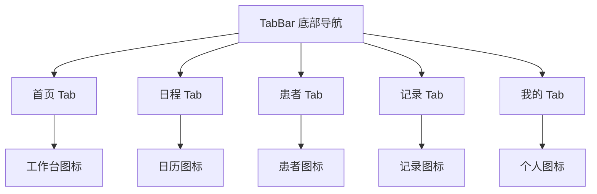
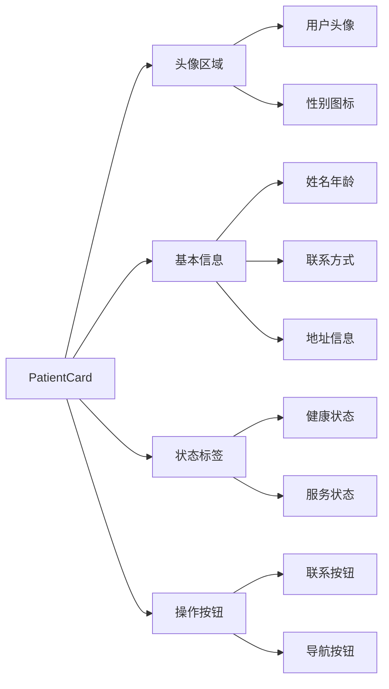
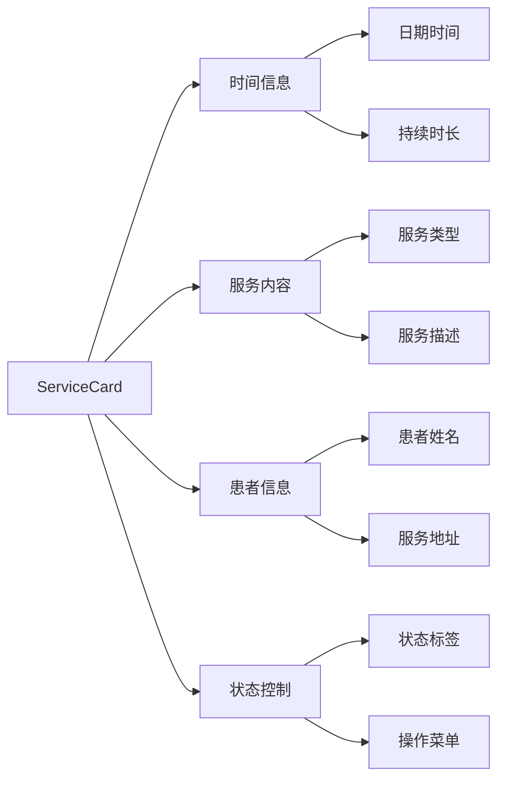
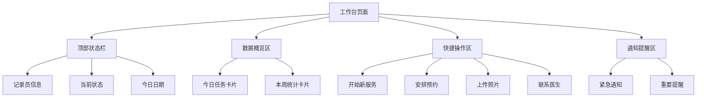
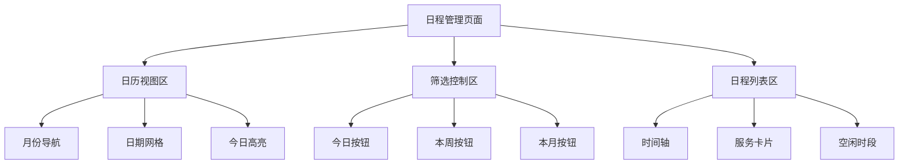
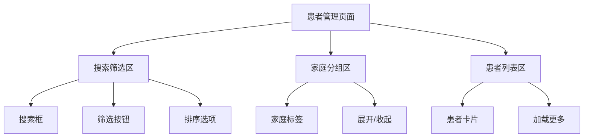
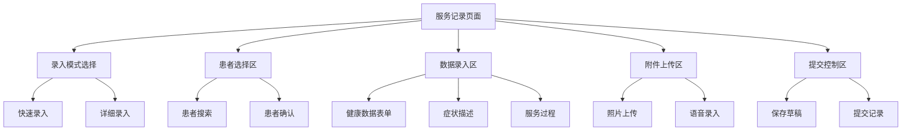

# 记录员小程序UI开发设计文档

## 1. 概述

本设计文档基于记录员小程序的需求分析和UI设计规范，提供了完整的微信小程序UI开发指导。该小程序主要服务于上门医疗护理人员，支持患者管理、服务记录、预约安排等核心功能的用户界面实现。

### 1.1 项目背景
- **目标用户**: 上门医疗护理记录员
- **核心价值**: 提供高效、专业的移动工作平台
- **平台类型**: 微信小程序

### 1.2 设计原则
- **专业医疗感**: 采用医疗蓝主色调传递专业感和信任感
- **简洁易用**: 界面简洁，减少视觉干扰，突出核心信息
- **移动优先**: 考虑记录员移动工作场景的特殊需求
- **高对比度**: 保证各种光线环境下的阅读清晰度

## 2. 技术架构

### 2.1 技术栈
- **框架**: 微信小程序原生开发
- **组件系统**: 微信小程序自定义组件
- **渲染引擎**: Skyline渲染引擎
- **组件框架**: Glass-Easel
- **样式方案**: WXSS + 原子化CSS

### 2.2 项目结构

```
recorder_client/
├── app.js              # 小程序入口文件
├── app.json            # 小程序全局配置
├── app.wxss            # 全局样式
├── components/         # 自定义组件
│   ├── navigation-bar/ # 自定义导航栏
│   ├── tab-bar/        # 底部导航栏
│   ├── patient-card/   # 患者信息卡片
│   ├── service-card/   # 服务记录卡片
│   └── common/         # 通用组件
├── pages/             # 页面目录
│   ├── index/         # 首页/工作台
│   ├── schedule/      # 日程管理
│   ├── patients/      # 患者管理
│   ├── records/       # 服务记录
│   └── profile/       # 个人中心
├── utils/             # 工具函数
├── assets/            # 静态资源
│   ├── images/        # 图片资源
│   └── icons/         # 图标资源
└── styles/            # 样式文件
    ├── variables.wxss # 设计变量
    └── mixins.wxss    # 样式混入
```

## 3. 设计规范

### 3.1 颜色系统

```
主色调:
- 医疗蓝: #007AFF (主要按钮、导航、重要信息)
- 深蓝色: #0056CC (悬停状态、强调)

状态色:
- 成功绿: #34C759 (完成状态、成功提示)
- 警告橙: #FF9500 (警告信息、待处理)
- 危险红: #FF3B30 (错误状态、紧急情况)
- 信息灰: #8E8E93 (辅助信息、禁用状态)

背景色:
- 主背景: #F8F9FA (页面主背景)
- 卡片背景: #FFFFFF (卡片、表单背景)
- 分割线: #E5E5E7 (边框、分割线)
```

### 3.2 字体规范

```
字体大小层级:
- 特大标题: 20px, font-weight: 600 (页面主标题)
- 大标题: 18px, font-weight: 600 (区块标题)
- 标题: 16px, font-weight: 500 (卡片标题)
- 正文: 14px, font-weight: 400 (主要内容)
- 辅助文字: 12px, font-weight: 400 (次要信息)
- 标签文字: 10px, font-weight: 400 (状态标签)

行高设置:
- 标题行高: 1.3倍
- 正文行高: 1.5倍
```

### 3.3 间距系统

```
间距变量:
- xs: 4rpx   (最小间距)
- sm: 8rpx   (小间距)
- md: 16rpx  (中等间距)
- lg: 24rpx  (大间距)
- xl: 32rpx  (特大间距)
- xxl: 48rpx (超大间距)

应用场景:
- 组件内部元素间距: 8rpx-16rpx
- 卡片间距: 16rpx-24rpx
- 页面边距: 24rpx-32rpx
- 区块间距: 32rpx-48rpx
```

### 3.4 图标系统

**功能图标参考资源**:
- 首页图标: 房屋outline图标，线条风格
- 日程图标: 日历outline图标，突出时间概念
- 患者图标: 用户群组图标，体现多人管理
- 记录图标: 文档编辑图标，表示录入功能
- 个人图标: 用户profile图标

**医疗专业图标**:
- 体温计图标: 温度测量
- 血压计图标: 血压监测
- 心率图标: 心跳监测
- 药品图标: 用药管理
- 注射器图标: 医疗操作

## 4. 组件架构

### 4.1 底部导航栏组件



**组件特性**:
- 固定底部显示
- 支持图标+文字模式
- 活动状态高亮显示
- 支持角标提醒功能

### 4.2 患者信息卡片组件



**设计要素**:
- 圆角卡片设计，阴影效果
- 左侧头像+右侧信息布局
- 状态标签颜色编码
- 快捷操作按钮

### 4.3 服务记录卡片组件



## 5. 页面设计架构

### 5.1 首页/工作台页面

**页面结构图**:



**设计要点**:
- 顶部固定状态栏，显示记录员基本信息
- 数据概览采用网格布局，突出关键数据
- 快捷操作使用大按钮设计，便于快速点击
- 通知区域采用横条设计，支持滑动关闭

**布局规范**:
- 页面整体使用垂直滚动布局
- 卡片间距16rpx，页面边距24rpx
- 数据卡片采用1:1比例，快捷按钮2:1比例

### 5.2 日程管理页面

**页面结构图**:



**交互设计**:
- 日历支持滑动切换月份
- 点击日期快速跳转到对应日期列表
- 服务卡片支持左滑显示快捷操作
- 支持长按进入批量编辑模式

### 5.3 患者管理页面

**页面架构**:



**设计特色**:
- 支持按家庭分组显示患者
- 搜索框固定顶部，支持实时搜索
- 患者卡片显示关键健康信息
- 右侧快速字母索引

### 5.4 服务记录页面

**页面组织**:



**功能特性**:
- 支持语音转文字录入
- 拍照上传自动压缩处理
- 表单数据本地缓存
- 离线模式支持

## 6. 交互设计

### 6.1 手势操作

| 手势 | 功能 | 应用场景 |
|------|------|----------|
| 左滑 | 快速操作菜单 | 服务卡片、患者卡片 |
| 右滑 | 返回/关闭 | 详情页面、弹窗 |
| 长按 | 批量选择模式 | 日程列表、患者列表 |
| 双击 | 快速编辑 | 文本内容、数据字段 |
| 下拉 | 刷新数据 | 列表页面 |
| 上滑 | 加载更多 | 长列表页面 |

### 6.2 状态反馈

**加载状态**:
- 页面级加载: 骨架屏占位
- 组件级加载: loading图标
- 按钮加载: 文字+loading

**错误处理**:
- 网络错误: Toast提示+重试按钮
- 表单错误: 字段高亮+错误提示
- 权限错误: 引导页面

**成功反馈**:
- 操作成功: 绿色Toast提示
- 保存成功: 按钮状态变化
- 提交成功: 页面跳转

### 6.3 语音交互

**语音录入场景**:
- 症状描述录入
- 服务过程记录
- 患者搜索

**语音控制设计**:
- 长按录音按钮开始录音
- 录音过程显示声波动画
- 支持录音暂停和继续
- 自动转换为文字并支持编辑

## 7. 响应式设计

### 7.1 屏幕适配

**尺寸断点**:
- 小屏设备: < 375px (iPhone SE)
- 标准设备: 375px - 414px (iPhone 12/13)
- 大屏设备: > 414px (iPhone 12/13 Pro Max)

**适配策略**:
- 使用rpx单位进行等比缩放
- 关键元素最小点击区域44rpx
- 文字大小根据屏幕密度调整
- 图片采用多倍图适配

### 7.2 横竖屏适配

**竖屏模式** (主要模式):
- 标准的移动端垂直布局
- 底部导航栏固定显示
- 内容区域可滚动

**横屏模式** (录入场景):
- 表单录入时支持横屏操作
- 键盘弹起时自动调整布局
- 重要操作按钮保持可见

## 8. 性能优化

### 8.1 图片优化

**图片处理策略**:
- 使用WebP格式优先，降级PNG
- 实现图片懒加载
- 缩略图+原图两级加载
- 本地缓存常用图片

**图片尺寸规范**:
- 头像图片: 120rpx × 120rpx
- 缩略图: 200rpx × 200rpx  
- 背景图: 750rpx × 400rpx
- 图标: 48rpx × 48rpx

### 8.2 数据加载优化

**分页加载**:
- 患者列表每页20条
- 服务记录每页15条
- 实现虚拟滚动对长列表优化

**缓存策略**:
- 患者基本信息本地缓存
- 常用数据离线存储
- 定时同步更新机制

## 9. 测试策略

### 9.1 兼容性测试

**设备测试范围**:
- iOS: iPhone 8+, iPad
- Android: 主流安卓机型
- 微信版本: 8.0+

**功能测试重点**:
- 拍照上传功能
- 语音录入功能
- GPS定位功能
- 离线数据同步

### 9.2 用户体验测试

**可用性测试**:
- 任务完成时间测试
- 错误操作恢复测试
- 学习成本评估

**无障碍测试**:
- 文字大小调节支持
- 高对比度模式
- 语音辅助功能

## 10. 部署与维护

### 10.1 发布流程

**版本管理**:
- 开发版本: 内部测试
- 体验版本: 用户预览测试
- 正式版本: 生产环境发布

**发布检查清单**:
- [ ] 功能测试完成
- [ ] 性能指标达标
- [ ] 安全审查通过
- [ ] 用户体验验收

### 10.2 监控与反馈

**性能监控**:
- 页面加载时间
- 接口响应时间
- 崩溃率统计
- 用户行为分析

**用户反馈渠道**:
- 应用内反馈入口
- 客服系统集成
- 用户调研活动
- 版本评价收集